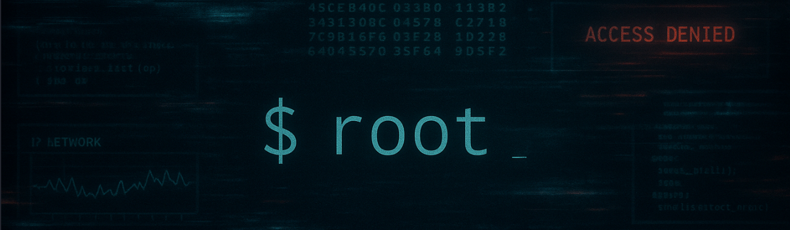

# TryHackMe Writeups

This repository contains my personal writeups for rooms completed on [TryHackMe](https://tryhackme.com/).
Each writeup includes tools used, techniques applied, key takeaways, and post-exploitation notes when applicable.

Periodically I will return to the laboratories and machines I have completed and make any changes or improvements to my solutions.

---

## Structure

Each room is organized into its own folder:

## ⚠️  Disclaimer

---

> These writeups are created for educational purposes only. Demonstration of tools and various pentesting techniques does not encourage their use outside the legal field.

> This repository should be used only for ethical purposes: to protect your own systems, improve cybersecurity skills, or within the framework of official agreements.

> The author is not responsible for direct or indirect damage resulting from the illegal use of the presented materials

---

## Contribute or Discuss

Spotted a mistake? Have suggestions or want to discuss something?

I'm always open to feedback and collaboration!
Reach out via [Twitter](https://x.com/sonyaflower995).
